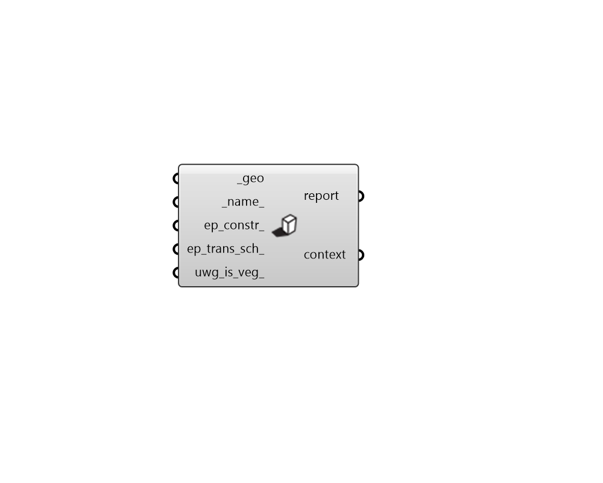

# ContextShade

 - [\[source code\]](https://github.com/ladybug-tools/dragonfly-grasshopper/blob/master/dragonfly_grasshopper/src//DF%20ContextShade.py)

Create Dragonfly ContextShade.

## Inputs

* **geo \[Required\]**

  Rhino Brep geometry. 

* **name**

  A name for the ContextShade. If the name is not provided a random name will be assigned. 

* **ep\_constr**

  Optional text for the ContextShade's energy construction to be looked up in the construction library. This can also be a custom construction object. If no energy construction is input here, a default will be assigned. 

* **ep\_trans\_sch**

  Optional text for the ContextShade's energy transmittance schedule to be looked up in the schedule library. This can also be a custom schedule object. If no energy schedule is input here, the default will be always opaque. 

* **uwg\_is\_veg**

  Boolean to note whether the shade represents a tree canopy within simulations with the Urban Weather Generator \(UWG\), in which case, it will be incorporated into the simulation as tree cover. \(Default: False\). 

## Outputs

* **report**

  Reports, errors, warnings, etc. 

* **context**

  Dragonfly ContextShades. 

