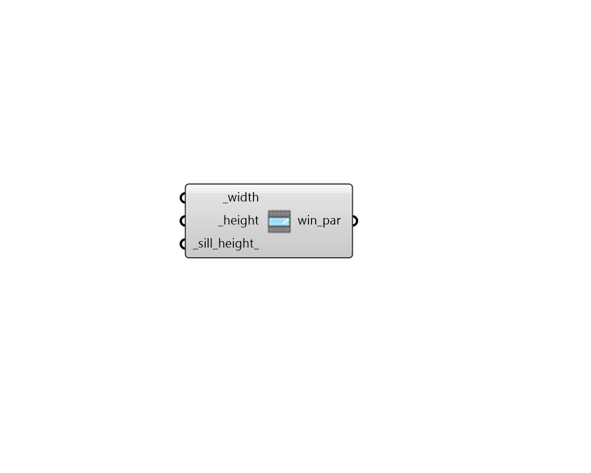

# Single Window Parameters

 - [\[source code\]](https://github.com/ladybug-tools/dragonfly-grasshopper/blob/master/dragonfly_grasshopper/src//DF%20Single%20Window%20Parameters.py)

Create Dragonfly window parameters with instructions for a single window in the face center defined by a width and height.

Note that, if these parameters are applied to a base face that is too short or too narrow for the input width and/or height, the generated window will automatically be shortened when it is applied to the face. In this way, setting the width to be a very high number will create parameters that always generate a ribboin window of the input height.

## Inputs

* **width \[Required\]**

  A number for the window width. 

* **height \[Required\]**

  A number for the window height. 

* **sill\_height**

  A number for the window sill height. Default: 0.8 meters. 

## Outputs

* **win\_par**

  Window Parameters that can be applied to a Dragonfly object using the "DF Apply Facade Parameters" component. 

