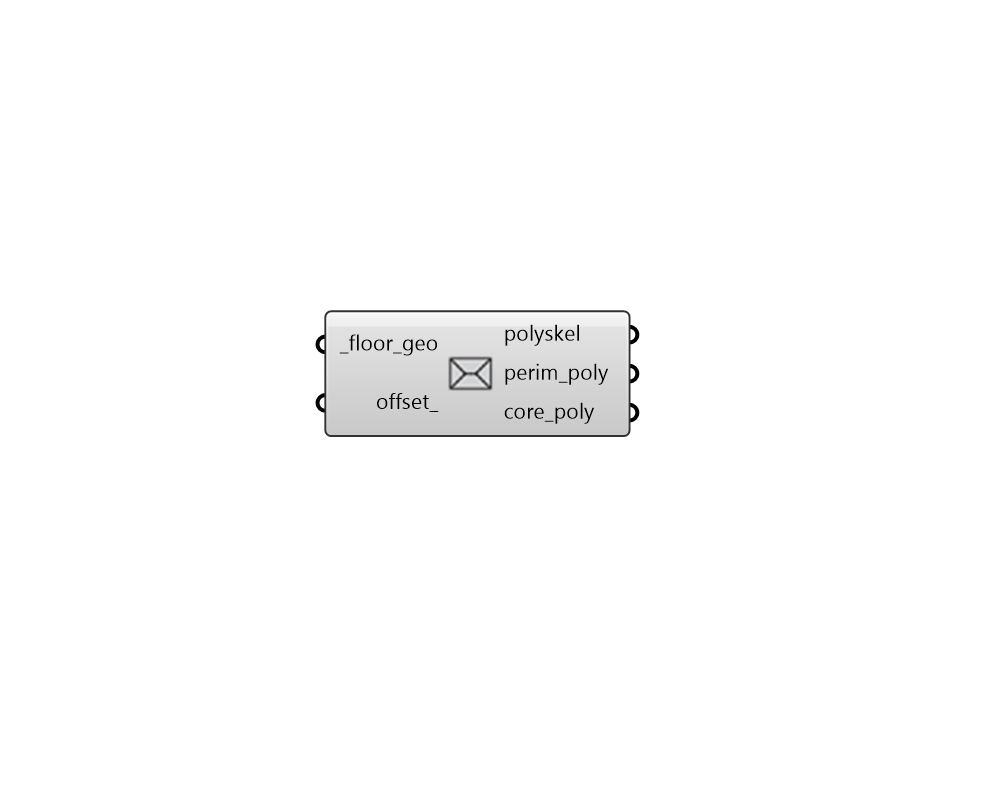

# Straight Skeleton

 - [\[source code\]](https://github.com/ladybug-tools/dragonfly-grasshopper/blob/master/dragonfly_grasshopper/src//DF%20Straight%20Skeleton.py)

Get the straight skeleton of any horizontal planar geometry.

This is can also be used to generate core/perimeter sub-polygons if an offset is input AND the straight skeleton is not self-intersecting. In the event of a self-intersecting straight skeleton, the output line segments can still be used to assist with the manual creation of core/perimeter offsets.

## Inputs

* **floor\_geo \[Required\]**

  A list of horizontal Rhino surfaces for which the straight skeleton will be computed. 

* **offset**

  An optional positive number that will be used to offset the perimeter of the geometry to output core/perimeter polygons. If a value is plugged in here and the straight skeleton is not self-intersecting, perim\_poly and core\_poly will be ouput. 

## Outputs

* **polyskel**

  A list of line segments that represent the straight skeleton of the input \_floor\_geo. This will be output from the component no matter what the input \_floor\_geo is. 

* **perim\_poly**

  A list of breps representing the perimeter polygons of the input _floor\_geo. This will only be ouput if an offset_ is input and the straight skeleton is not self-intersecting. 

* **core\_poly**

  A list of breps representing the core polygons of the input _floor\_geo. This will only be ouput if an offset_ is input and the straight skeleton is not self-intersecting, and the offset is not so great as to eliminate the core. 

