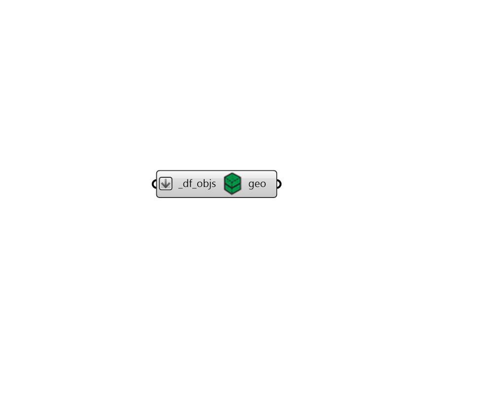

# Vizualize All

 - [\[source code\]](https://github.com/ladybug-tools/dragonfly-grasshopper/blob/master/dragonfly_grasshopper/src//DF%20Vizualize%20All.py)

Preview any Dragonfly geometry object within the Rhino scene, including all stories represented by multipliers

## Inputs

* **df\_objs \[Required\]**

  A Dragonfly Model, Building, Story, Room2D, or ContextShade to be previewed in the Rhino scene. 

## Outputs

* **geo**

  The Rhino version of the Dragonfly geometry object, which will be visible in the Rhino scene. 

