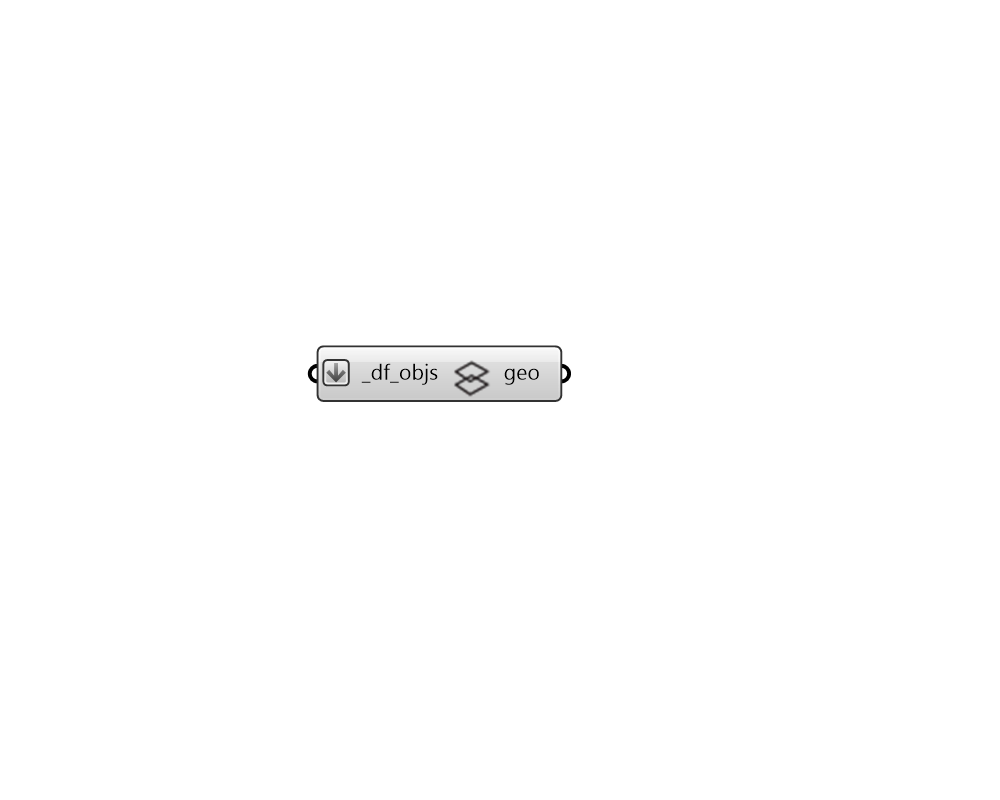

# Vizualize Wireframe

 - [\[source code\]](https://github.com/ladybug-tools/dragonfly-grasshopper/blob/master/dragonfly_grasshopper/src//DF%20Vizualize%20Wireframe.py)

Quickly preview any Dragonfly geometry object as a wire frame within the Rhino scene, including all stories represented by multipliers

## Inputs

* **df\_objs \[Required\]**

  A Dragonfly Model, Building, Story, Room2D, or ContextShade to be previewed as a wire frame in the Rhino scene. 

## Outputs

* **geo**

  The Rhino version of the Dragonfly geometry object, which will be visible in the Rhino scene. 

