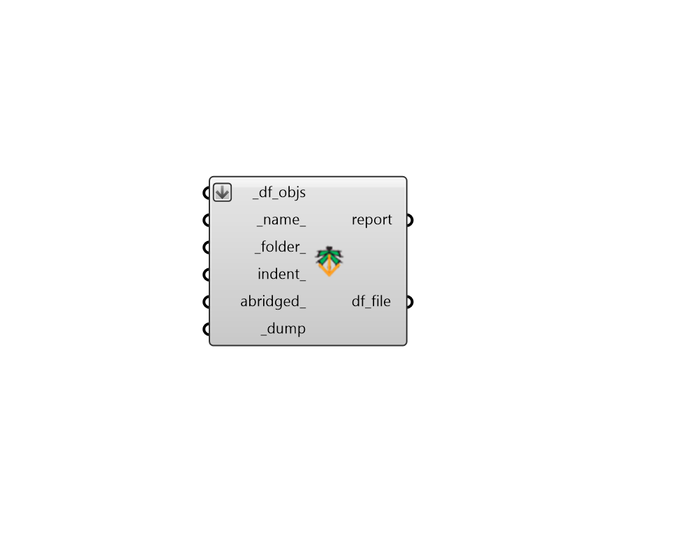

# Dump Objects

 - [\[source code\]](https://github.com/ladybug-tools/dragonfly-grasshopper/blob/master/dragonfly_grasshopper/src//DF%20Dump%20Objects.py)

Dump any dragonfly object to a JSON file. You can use "DF Load Objects" component to load the objects from the file back into Grasshopper.

This includes any Model, Building, Story, Room2D, WindowParameter, or ShadingParameter.

It also includes any energy Material, Construction, ConstructionSet, Schedule, Load, ProgramType, or Simulation object.

## Inputs

* **df\_objs \[Required\]**

  A list of Dragonfly objects to be written to a file. 

* **name**

  A name for the file to which the dragonfly objects will be written. \(Default: 'unnamed'\). 

* **folder**

  An optional directory into which the dragonfly objects will be written.  The default is set to the default simulation folder. 

* **indent**

  An optional positive integer to set the indentation used in the resulting JSON file. 

* **abridged**

  Set to "True" to serialize the object in its abridged form. Abridged objects cannot be reserialized back to dragonfly objects on their own but they are used throughout dragonfly to minimize file size and unnecessary duplication. 

* **dump \[Required\]**

  Set to "True" to save the dragonfly objects to file. 

## Outputs

* **report**

  Errors, warnings, etc. 

* **df\_file**

  The location of the file where the dragonfly JSON is saved. 

