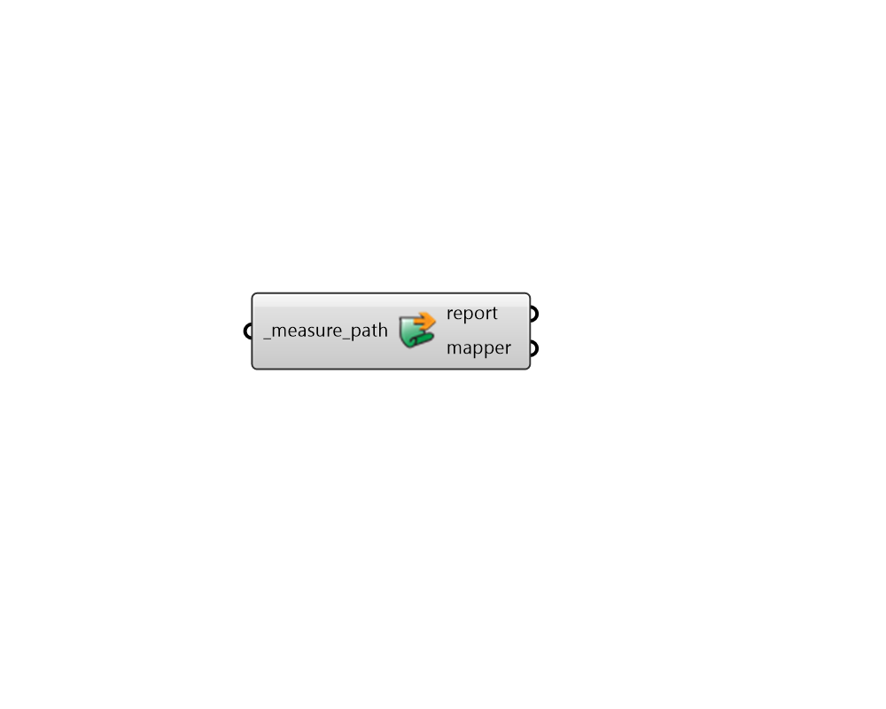

# Load Mapper Measure

 - [\[source code\]](https://github.com/ladybug-tools/dragonfly-grasshopper/blob/master/dragonfly_grasshopper/src//DF%20Load%20Mapper%20Measure.py)

Load OpenStudio measures into Grasshopper and assign the measure's input arguments in a manner that can be mapped to different buildings in a Dragonfly model.

The resulting measure object can be plugged into the "measures\_" input of the "DF Run URBANopt" component in order to be included in the simulation.

## Inputs

* **measure\_path \[Required\]**

  Path to the folder in which the measure exists. This folder must contain a measure.rb and a measure.xml file. Note that connecting an input here will transform the component, essentially removing this input and changing all of the other component inputs to be input arguments for the measure. 

## Outputs

* **report**

  The execution information, as output and error streams 

* **mapper**

  A mapper measure object can be plugged into the "measures\_" input of the "DF Run URBANopt" component in order to be included in the simulation. 

