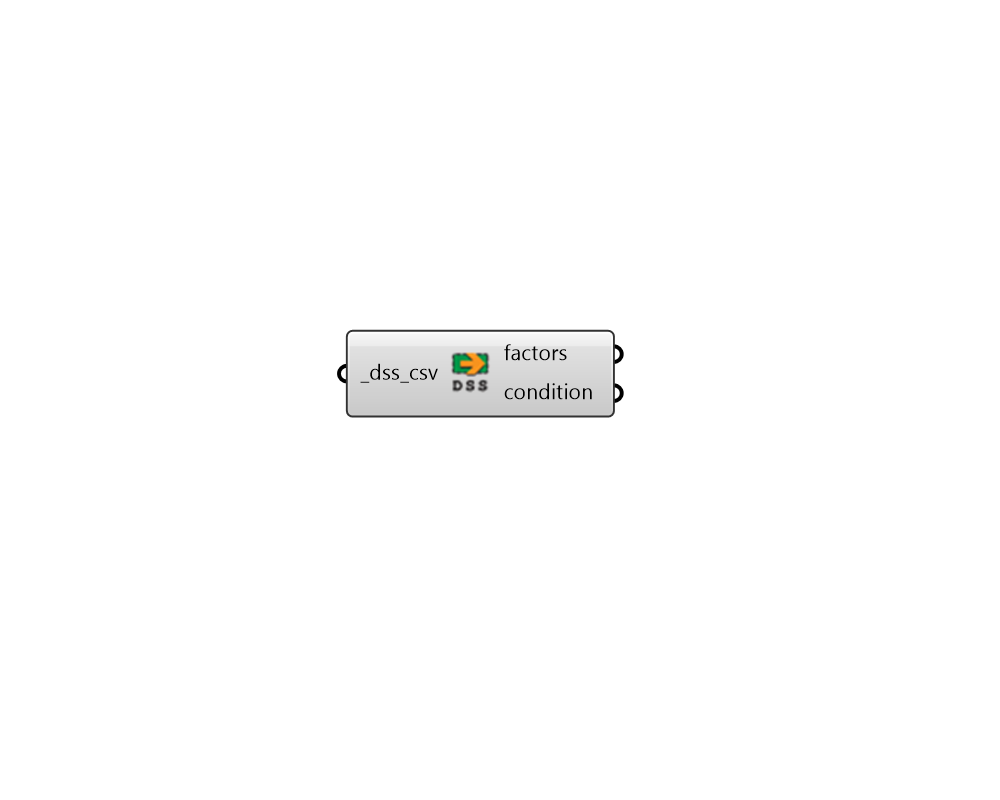

# Read OpenDSS Result

 - [\[source code\]](https://github.com/ladybug-tools/dragonfly-grasshopper/blob/master/dragonfly_grasshopper/src//DF%20Read%20OpenDSS%20Result.py)

Parse any CSV file output from an OpenDSS simulation.

## Inputs

* **dss\_csv \[Required\]**

  The file path of any CSV result file that has been generated from an OpenDSS simulation. This can be either a Building CSV with voltage information or transformers/connectors with loading information. 

## Outputs

* **factors**

  A list of data collections containing the dimensionless fractional values from the CSV results. For buildings, these represent the voltage at a given timestep divided by the standard outlet voltage \(120 V\). For transformers and connectors, these represent the power along the wire or transformer divided by the kVA rating of the object. 

* **condition**

  A list of data collections noting the condition of a given object. For example, whether the object is over or under voltage \(in the case of a building\) or whether it is overloaded \(in the case of a transformer or electrical connector\). 

