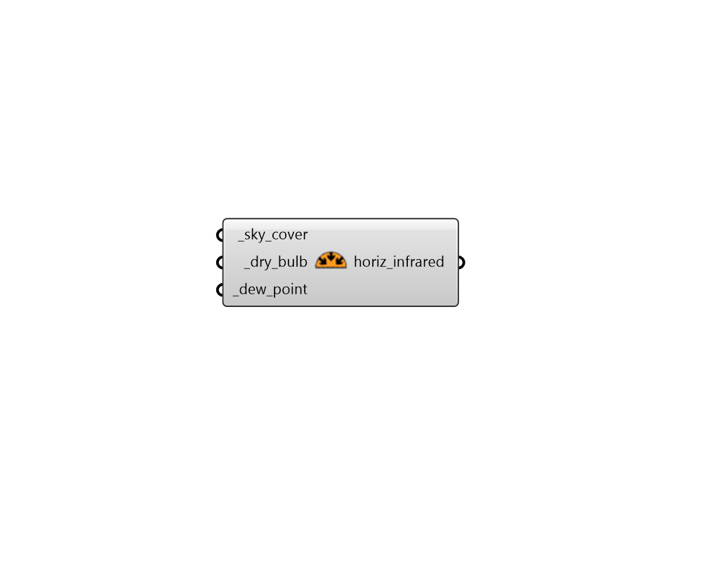

# Horizontal Infrared

 - [\[source code\]](https://github.com/ladybug-tools/dragonfly-grasshopper/blob/master/dragonfly_grasshopper/src//DF%20Horizontal%20Infrared.py)

Calculate downwelling horizontal infrared radiation intensity from sky cover, dry bulb temperature, and dew point temperature.

## Inputs

* **sky\_cover \[Required\]**

  A value or data collection representing sky cover \[tenths\] 

* **dry\_bulb \[Required\]**

  A value or data collection representing  dry bulb temperature \[C\] 

* **dew\_point \[Required\]**

  A value or data collection representing dew point temperature \[C\] 

## Outputs

* **horiz\_infrared**

  A data collection or value indicating the downwelling horizontal infrared radiation \[W/m2\] 

