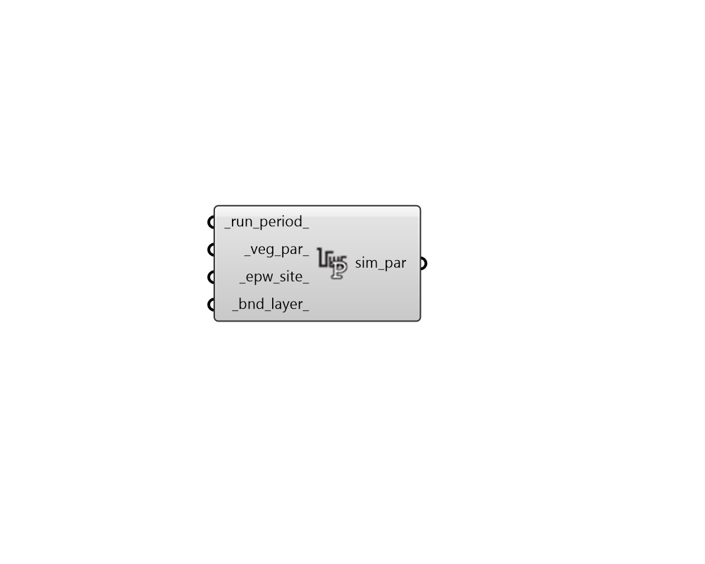

# UWG Simulation Parameter

 - [\[source code\]](https://github.com/ladybug-tools/dragonfly-grasshopper/blob/master/dragonfly_grasshopper/src//DF%20UWG%20Simulation%20Parameter.py)

Create a simulation parameter object that carries a complete set of Urban Weather Genreator \(UWG\) simulation settings and can be plugged into the "DF Run Urban Weather Generator" component.

## Inputs

* **run\_period**

  A Ladybug Analysis Period object to describe the time period over which to run the simulation. If None, the simulation will be run for the whole year. 

* **veg\_par**

  A VegetationParameter object to specify the behavior of vegetation in the urban area. If None, generic vegetation parameters will be generated. 

* **epw\_site**

  A ReferenceEPWSite object to specify the properties of the reference site where the input rural EPW was recorded. If None, generic airport properties will be generated. 

* **bnd\_layer**

  A BoundaryLayerParameter to specify the properties of the urban boundary layer. If None, generic boundary layer parameters will be generated. 

## Outputs

* **sim\_par**

  A UWG SimulationParameter object that can be connected to the "DF Run Urban Weather Generator" component in order to specify UWG simulation settings 

