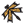

#### Component list:
*  [Object to String](../components/Object_to_String.md)
*  [String to Object](../components/String_to_Object.md)
*  [Dump Objects](../components/Dump_Objects.md)
*  [Load Objects](../components/Load_Objects.md)
*  [Model To Honeybee](../components/Model_To_Honeybee.md)
*  [Model To geoJSON](../components/Model_To_geoJSON.md)
*  [Model From Honeybee](../components/Model_From_Honeybee.md)
*  [Model From geoJSON](../components/Model_From_geoJSON.md)
*  [Validate Model](../components/Validate_Model.md)