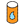
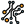
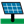
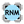
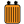

#### Component list:
*  [Run REopt](../components/Run_REopt.md)
*  [Run URBANopt](../components/Run_URBANopt.md)
*  [Diversify Building Programs](../components/Diversify_Building_Programs.md)
*  [Process Load](../components/Process_Load.md)
*  [Reassign Energy Properties](../components/Reassign_Energy_Properties.md)
*  [Window Opening](../components/Window_Opening.md)
*  [All-Air HVAC](../components/All-Air_HVAC.md)
*  [DOAS HVAC](../components/DOAS_HVAC.md)
*  [HeatCool HVAC](../components/HeatCool_HVAC.md)
*  [IdealAir](../components/IdealAir.md)
*  [Load Mapper Measure](../components/Load_Mapper_Measure.md)
*  [SHW System](../components/SHW_System.md)
*  [Color Network Results](../components/Color_Network_Results.md)
*  [Electrical Connector](../components/Electrical_Connector.md)
*  [Electrical Network](../components/Electrical_Network.md)
*  [Ground Photovoltaics](../components/Ground_Photovoltaics.md)
*  [REopt Financial Parameters](../components/REopt_Financial_Parameters.md)
*  [Read OpenDSS Result](../components/Read_OpenDSS_Result.md)
*  [Road Network](../components/Road_Network.md)
*  [Run OpenDSS](../components/Run_OpenDSS.md)
*  [Run RNM](../components/Run_RNM.md)
*  [Search OpenDSS](../components/Search_OpenDSS.md)
*  [Substation](../components/Substation.md)
*  [Transformer](../components/Transformer.md)