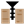

#### Component list:
*  [Run Modelica](../components/Run_Modelica.md)
*  [Write Modelica DES](../components/Write_Modelica_DES.md)
*  [Fourth Generation Thermal Loop](../components/Fourth_Generation_Thermal_Loop.md)
*  [GHE Thermal Loop](../components/GHE_Thermal_Loop.md)
*  [GHE Borehole Parameter](../components/GHE_Borehole_Parameter.md)
*  [GHE Design Parameter](../components/GHE_Design_Parameter.md)
*  [GHE Fluid Parameter](../components/GHE_Fluid_Parameter.md)
*  [GHE Pipe Parameter](../components/GHE_Pipe_Parameter.md)
*  [GHE Soil Parameter](../components/GHE_Soil_Parameter.md)
*  [Horizontal Pipe Parameter](../components/Horizontal_Pipe_Parameter.md)
*  [Read GHE Sizing](../components/Read_GHE_Sizing.md)
*  [Assign DES Building Loads](../components/Assign_DES_Building_Loads.md)
*  [GHE Designer](../components/GHE_Designer.md)
*  [Model To DES](../components/Model_To_DES.md)