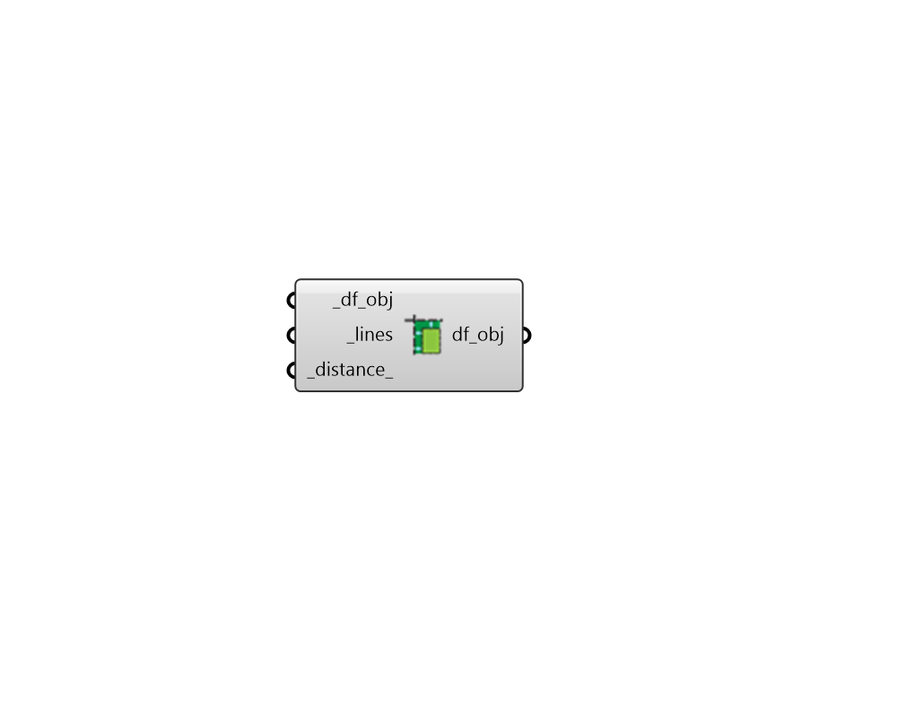

## Align

 - [[source code]](https://github.com/ladybug-tools/dragonfly-grasshopper/blob/master/dragonfly_grasshopper/src//DF%20Align.py)

Move Room2D vertices within a given distance of a line to be on that line. 

This is particularly useful for cleaning up models with extra unwanted corrugations in them around columns and other "room bounding" elements. 

Note that, when there are small Room2Ds next to the input lines, this component may completely remove the small Room2D if it becomes degenerate. 

#### Inputs
* ##### df_obj [Required]
A Dregonfly Story, Building or Model to be aligned to the input lines. For Buildings and Models, all Room2Ds across the object will be aligned. 
* ##### lines [Required]
A list of straignt lines to which the Room2D vertices will be aligned. 
* ##### distance 
The maximum distance between a vertex and a line where the vertex will be moved to lie on the line. Vertices beyond this distance will be left as they are. The default is 0.5 meters. 

#### Outputs
* ##### df_obj
The input Dragonfly objects with Room2Ds that have been aligned to the input lines. 