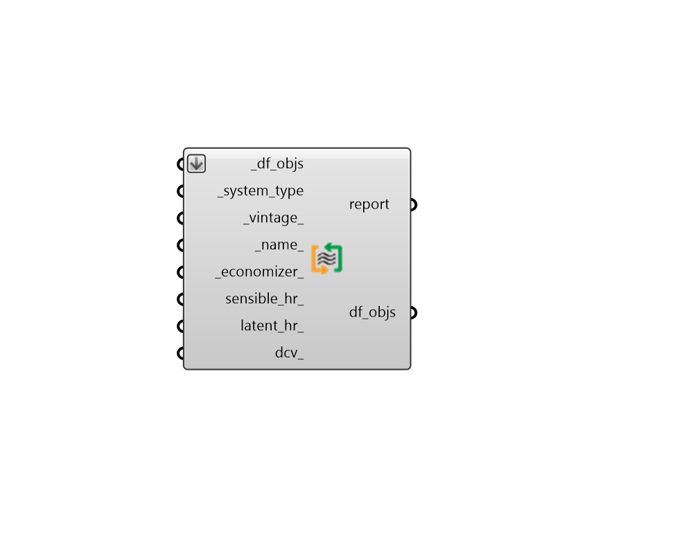

## All-Air HVAC

 - [[source code]](https://github.com/ladybug-tools/dragonfly-grasshopper/blob/master/dragonfly_grasshopper/src//DF%20All-Air%20HVAC.py)

Apply an All-Air template HVAC to a list of Dragonfly Buildings, Stories or Room2Ds. 

All-air systems provide both ventilation and satisfaction of heating + cooling demand with the same stream of warm/cool air. As such, they often grant tight control over zone humidity. However, because such systems often involve the cooling of air only to reheat it again, they are often more energy intensive than systems that separate ventilation from the meeting of thermal loads. 

#### Inputs
* ##### df_objs [Required]
Dragonfly Buildings, Stories or Room2Ds to which the input template HVAC will be assigned. If a list of Room2Ds is input, all objects will receive the same HVAC instance. Otherwise, each object gets its own instance (eg. each input Story will get its own HVAC). This can also be an etire dragonfly Model. 
* ##### system_type [Required]
Text for the specific type of all-air system and equipment. The "HB All-Air HVAC Templates" component has a full list of the supported all-air system templates. 
* ##### vintage 
Text for the vintage of the template system. This will be used to set efficiencies for various pieces of equipment within the system. The "HB Building Vintages" component has a full list of supported HVAC vintages. (Default: ASHRAE_2019). 
* ##### name 
Text to set the name for the HVAC system and to be incorporated into unique HVAC identifier. If the name is not provided, a random name will be assigned. 
* ##### economizer 
Text to indicate the type of air-side economizer used on the HVAC system. Economizers will mix in a greater amount of outdoor air to cool the zone (rather than running the cooling system) when the zone needs cooling and the outdoor air is cooler than the zone. Choose from the options below. (Default: NoEconomizer). 

    * NoEconomizer

    * DifferentialDryBulb

    * DifferentialEnthalpy

    * DifferentialDryBulbAndEnthalpy

    * FixedDryBulb

    * FixedEnthalpy

    * ElectronicEnthalpy
* ##### sensible_hr 
A number between 0 and 1 for the effectiveness of sensible heat recovery within the system. Typical values range from 0.5 for simple glycol loops to 0.81 for enthalpy wheels (the latter tends to be fiarly expensive for air-based systems). (Default: 0). 
* ##### latent_hr 
A number between 0 and 1 for the effectiveness of latent heat recovery within the system. Typical values are 0 for all types of heat recovery except enthalpy wheels, which can have values as high as 0.76. (Default: 0). 
* ##### dcv 
Boolean to note whether demand controlled ventilation should be used on the system, which will vary the amount of ventilation air according to the occupancy schedule of the zone. (Default: False). 

#### Outputs
* ##### report
Script variable OSHVACSystems 
* ##### df_objs
The input Dragonfly objects with an all-air HVAC system applied. 