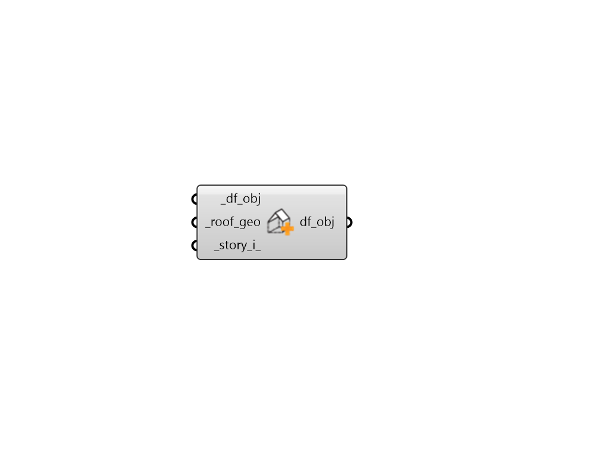

## Apply Roof

 - [[source code]](https://github.com/ladybug-tools/dragonfly-grasshopper/blob/master/dragonfly_grasshopper/src//DF%20Apply%20Roof.py)

Assign Roof geometry to a Dragonfly Story, Building, or Model. 

This can be used to generate sloped roofs over a Story. The roof geometry will only affect the Room2Ds that have a True is_top_exposed property and it will only be utilized in translation to Honeybee when the Story multiplier is 1. 

Multiple sucessive versions of this component can be used to assign different roof specifications for different Stories of a Dragonfly Building or Model. 

#### Inputs
* ##### df_obj [Required]
A Dregonfly Story or Building to which the roof geometry is assigned. When a building is plugged in, only one story will receive the roof geometry, which will be the top floor unless an explicit _story_i_ is specified below. This input can also be an entire Dragonfly Model, in which case the relevant Story of the first Building will receive the roof geometry, indicating that a Model inputs are really only appropriate when the Model contains one Building. 
* ##### roof_geo [Required]
A list of Breps representing the geometry of the Roof. Together, these Breps should completely cover the Room2Ds of the Story to which they are assigned. 
* ##### story_i 
An optional integer to set the index of the Story to which the Roof should be assigned. If unspecified, the roof geometry will be added to the top floor of any connected Building or Model. 

#### Outputs
* ##### df_obj
The input Dragonfly objects with the roof geometry assigned to them. 