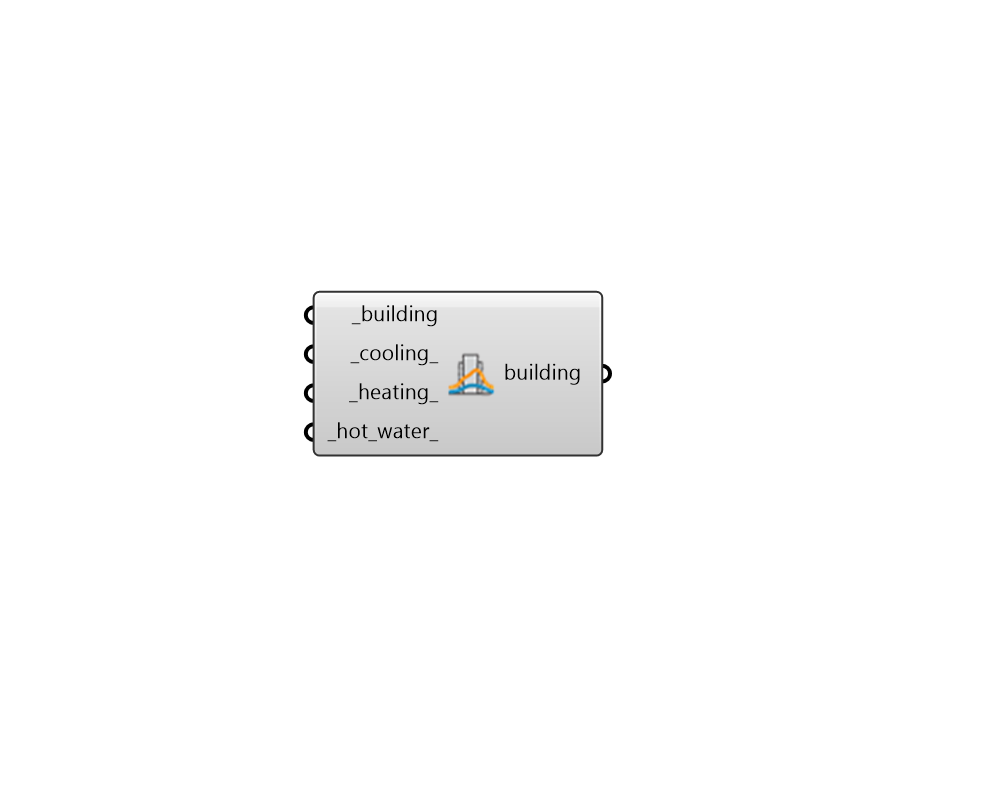

## Assign DES Building Loads

 - [[source code]](https://github.com/ladybug-tools/dragonfly-grasshopper/blob/master/dragonfly_grasshopper/src//DF%20Assign%20DES%20Building%20Loads.py)

Assign cooling, heating and hot water loads to a Dragonfly Building to be used within a District Energy System (DES) simulation. 

This component is intended specifically for the case that District Energy System (DES) simulation is to be performed without using URBANopt to generate building energy loads through EnergyPlus. 

#### Inputs
* ##### building [Required]
A Dragonfly Building, Story or Room2D which is to have its energy properties re-assigned. This can also be an entire Dragonfly Model. 
* ##### cooling 
An annual hourly data collection for building cooling loads for simulation with a DES. Note that this data collection must have a data type of Power. 
* ##### heating 
An annual hourly data collection for building heating loads for simulation with a DES. Note that this data collection must have a data type of Power. 
* ##### hot_water 
An annual hourly data collection for building service hot water loads for simulation with a DES. Note that this data collection must have a data type of Power. 

#### Outputs
* ##### building
The input Dragonfly Building with DES loads assigned to it. The Model created with this Building can be converted directly into a format that works with DES simulation using the "DF Model to DES" component without the need to run EnergyPlus simulations with the "DF Run URBANopt" component. 