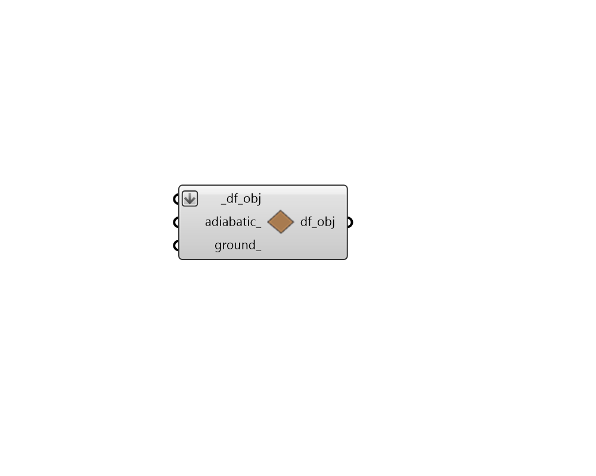

## BC by Orientation

 - [[source code]](https://github.com/ladybug-tools/dragonfly-grasshopper/blob/master/dragonfly_grasshopper/src//DF%20BC%20by%20Orientation.py)

Make boundary conditions of Dragonfly Room2Ds Adiabatic or Ground by oreintation. 

Note that this component will remove windows for any wall segment that is set to have an Adiabatic or Ground boundary condition. 

#### Inputs
* ##### df_obj [Required]
A Dragonfly Building, Story or Room2D which will have boundary conditions assigned to its walls according to the inputs below. 
* ##### adiabatic 
A list of Booleans to denote whether exterior walls of a given orientation should be set to adiabatic. Different adiabatic values will be assigned based on the cardinal direction, starting with north and moving clockwise. The "HB Facade Parameters" component can be used to order this list correctly for four main orientations. 
* ##### ground 
A list of Booleans to denote whether exterior walls of a given orientation should be set to ground. Different ground values will be assigned based on the cardinal direction, starting with north and moving clockwise. The "HB Facade Parameters" component can be used to order this list correctly for four main orientations. 

#### Outputs
* ##### df_obj
The input Dragonfly object with the wall boundary conditions changed. 