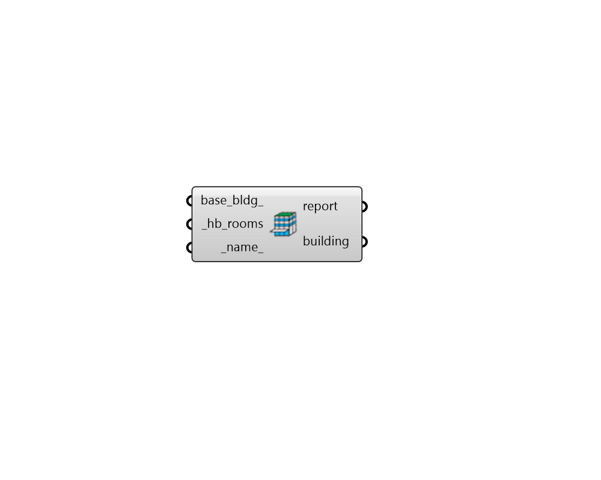

## Building from Detailed Rooms

 - [[source code]](https://github.com/ladybug-tools/dragonfly-grasshopper/blob/master/dragonfly_grasshopper/src//DF%20Building%20from%20Detailed%20Rooms.py)

Create a Dragonfly Building from detailed Honeybee Rooms. 

This is useful when there are parts of the Building geometry that cannot easily be represented with the extruded floor plate and sloped roof assumptions that underlie Dragonfly Room2Ds and RoofSpecification. Cases where this input is most useful include sloped walls and certain types of domed roofs that become tedious to implement with RoofSpecification. 

#### Inputs
* ##### base_bldg 
An optional Dragonfly Building. 
* ##### hb_rooms [Required]
Honeybee Room objects for additional Rooms that are a part of the Building but are not represented within the Stories or Room2Ds. Matching the Honeybee Room story property (assigned with the "HB Set Multiplier" component) to the Dragonfly Story name will effectively place the Honeybee Room on that Story for the purposes of floor_area, exterior_wall_area, etc. However, note that the Honeybee Room.multiplier property takes precedence over whatever multiplier is assigned to the Dragonfly Story that the Room.story may reference. 
* ##### name 
Text to set the name for the Building, which will also be incorporated into unique Building identifier. If the name is not provided a random one will be assigned. 

#### Outputs
* ##### report
Reports, errors, warnings, etc. 
* ##### building
Dragonfly Building. 