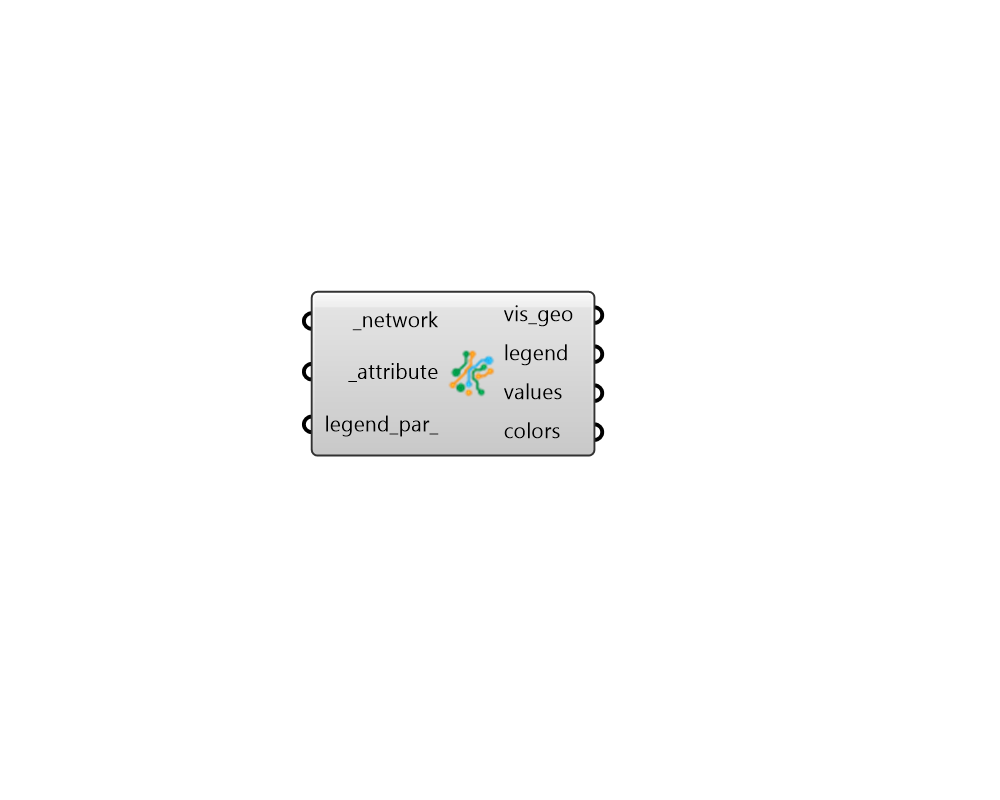

## Color Network Attributes

 - [[source code]](https://github.com/ladybug-tools/dragonfly-grasshopper/blob/master/dragonfly_grasshopper/src//DF%20Color%20Network%20Attributes.py)

Color a Dragonfly ElectricalNewtwork in the Rhino scene using its attributes. 

This can be used as a means to check that correct properties are assigned to different Transformers and ElectricalConnectors. 

#### Inputs
* ##### network [Required]
A Dragonfly Electrical Newtork object to be colored with its attributes in the Rhino scene. 
* ##### attribute [Required]
Text for the name of the equipment attribute with which the Newtork should be colored. The "DF Network Attributes" component lists all of the attributes of the equipment of an ElectricalNetwork. 
* ##### legend_par 
An optional LegendParameter object to change the display of the colored output. (Default: None). 

#### Outputs
* ##### vis_geo
Meshes and line segments colored according to their attributes. 
* ##### legend
Geometry representing the legend for colored objects. 
* ##### values
A list of values that align with the input substation, transformers and electrical connectors. These note the attribute assigned to each object. 
* ##### colors
A list of colors that align with the input substation, transformers and electrical connectors. These note the color of each object in the Rhino scene. 