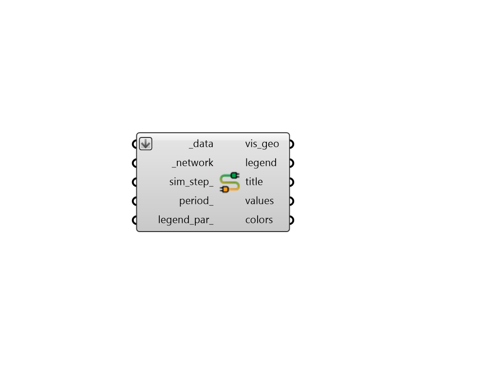

## Color Network Results

 - [[source code]](https://github.com/ladybug-tools/dragonfly-grasshopper/blob/master/dragonfly_grasshopper/src//DF%20Color%20Network%20Results.py)

Color a Dragonfly ElectricalNewtwork in the Rhino scene with OpenDSS simulation results. 

#### Inputs
* ##### data [Required]
A list of data collections of the same data type, which will be used to color the network with simulation results. These should come from the "DF Read OpenDSS Result" component. 
* ##### network [Required]
A Dragonfly Electrical Newtork object to be colored with results in the Rhino scene. 
* ##### sim_step 
An optional integer (greater than or equal to 0) to select a specific step of the data collections for which result values will be generated. If None, the geometry will be colored with the maximum of resutls in the _data, essentially describing the peak condition. (Default: None). 
* ##### period 
A Ladybug analysis period to be applied to all of the input _data. 
* ##### legend_par 
An optional LegendParameter object to change the display of the colored output. (Default: None). 

#### Outputs
* ##### vis_geo
Meshes and line segments colored according to the results. 
* ##### legend
Geometry representing the legend for colored objects. 
* ##### title
A text object for the global title. 
* ##### values
A list of values that align with the input substation, transformers and electrical connectors. These note the value assigned to each object. 
* ##### colors
A list of colors that align with the input substation, transformers and electrical connectors. These note the color of each object in the Rhino scene. 