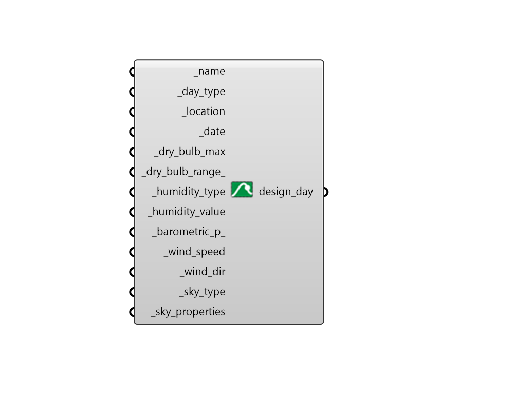

## Construct Design Day

 - [[source code]](https://github.com/ladybug-tools/dragonfly-grasshopper/blob/master/dragonfly_grasshopper/src//DF%20Construct%20Design%20Day.py)

Construct a design day from a set of parameters. 

#### Inputs
* ##### name [Required]
The name of the DesignDay object. 
* ##### day_type [Required]
Text indicating the type of design day (ie. 'SummerDesignDay', 'WinterDesignDay' or other EnergyPlus days). 
* ##### location [Required]
A Ladybug Location object describing the location of the design day. 
* ##### date [Required]
A Ladybug Date for the day of the year on which the design day occurs. This should be in the format of 'DD Month' (eg. '1 Jan', '4 Jul'). The LB Calculate HOY component can also be used to construct this date. 
* ##### dry_bulb_max [Required]
Maximum dry bulb temperature over the design day (in C). 
* ##### dry_bulb_range 
Dry bulb range over the design day (in C). 
* ##### humidity_type [Required]
Type of humidity to use. (ie. Wetbulb, Dewpoint, HumidityRatio, Enthalpy) 
* ##### humidity_value [Required]
The value of the humidity condition above. 
* ##### barometric_p 
Barometric pressure in Pa. 
* ##### wind_speed [Required]
Wind speed over the design day in m/s. 
* ##### wind_dir [Required]
Wind direction over the design day in degrees. 
* ##### sky_type [Required]
Type of solar model to use.  (eg. ASHRAEClearSky, ASHRAETau) 
* ##### sky_properties [Required]
A list of properties describing the sky above. For ASHRAEClearSky this is a single value for clearness. For ASHRAETau, this is the tau_beam and tau_diffuse. 

#### Outputs
* ##### design_day
Script output design_day. 