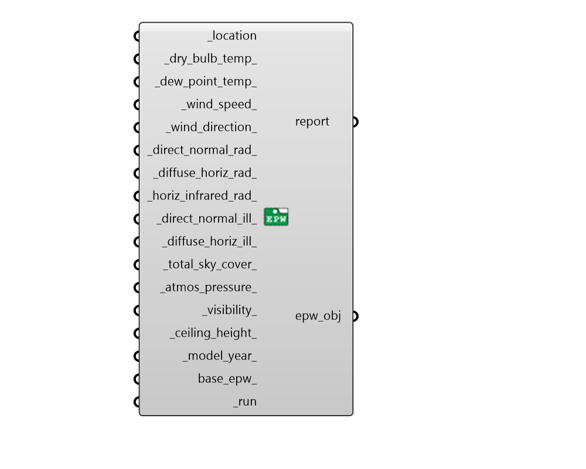

## Create EPW

 - [[source code]](https://github.com/ladybug-tools/dragonfly-grasshopper/blob/master/dragonfly_grasshopper/src//DF%20Create%20EPW.py)

Create a custom EPW object from a location and data collections of annual hourly data. 

#### Inputs
* ##### location [Required]
A location object for the epw_file. 
* ##### dry_bulb_temp 
Annual hourly data collection for dry bulb temperature [C] 
* ##### dew_point_temp 
Annual hourly data collection for dew point temperature [C] 
* ##### wind_speed 
Annual hourly data collection for wind speed [m/s] 
* ##### wind_direction 
Annual hourly data collection for wind direction [degrees] 
* ##### direct_normal_rad 
Annual hourly data collection for direct normal radiation [Wh/m2] or [W/m2] 
* ##### diffuse_horiz_rad 
Annual hourly data collection for diffuse horizontal radiation [Wh/m2] or [W/m2] 
* ##### horiz_infrared_rad 
Annual hourly data collection for horizontal infrared radiation intensity [Wh/m2] or [W/m2] 
* ##### direct_normal_ill 
Annual hourly data collection for direct normal illuminance [lux] 
* ##### diffuse_horiz_ill 
Annual hourly data collection for diffuse horizontal illuminance [lux] 
* ##### total_sky_cover 
Annual hourly data collection for the fraction for total sky cover [tenths] 
* ##### atmos_pressure 
Annual hourly data collection for weather station pressure [Pa] 
* ##### visibility 
Annual hourly data collection for visibility [km] 
* ##### ceiling_height 
Annual hourly data collection for cloud ceiling height [m] 
* ##### model_year 
Annual hourly data collection for the year from which the hourly data has been extracted. This input is necessary when the input data collections are from a leap year. 
* ##### base_epw 
File path to an optional .epw to fill empty slots for data that has not been connected here. 
* ##### run [Required]
Set to True to run the component and create the epw_obj. 

#### Outputs
* ##### report
Reports, errors, warnings, etc. 
* ##### epw_obj
An EPW object that can be written to a file using the Write EPW component. 