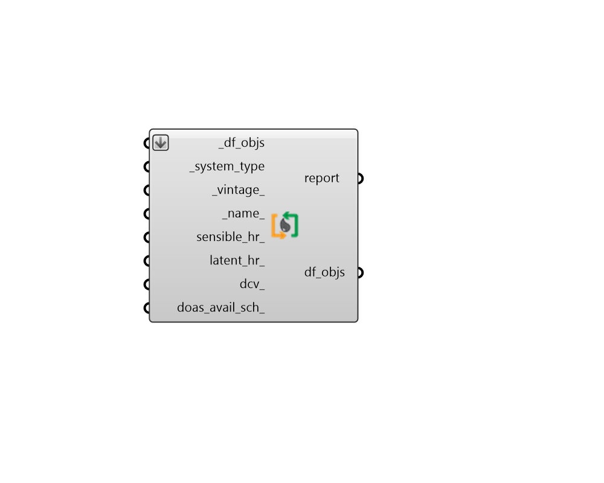

## DOAS HVAC

 - [[source code]](https://github.com/ladybug-tools/dragonfly-grasshopper/blob/master/dragonfly_grasshopper/src//DF%20DOAS%20HVAC.py)

Apply a Dedicated Outdoor Air System (DOAS) template HVAC to a list of Dragonfly Buildings, Stories or Room2Ds. 

DOAS systems separate minimum ventilation supply from the satisfaction of heating + cooling demand. Ventilation air tends to be supplied at neutral temperatures (close to room air temperature) and heating / cooling loads are met with additional pieces of zone equipment (eg. Fan Coil Units (FCUs)). 

Because DOAS systems only have to cool down and re-heat the minimum ventilation air, they tend to use less energy than all-air systems. They also tend to use less energy to distribute heating + cooling by puping around hot/cold water or refrigerant instead of blowing hot/cold air. However, they do not provide as good of control over humidity and so they may not be appropriate for rooms with high latent loads like auditoriums, kitchens, laundromats, etc. 

#### Inputs
* ##### df_objs [Required]
Dragonfly Buildings, Stories or Room2Ds to which the input template HVAC will be assigned. If a list of Room2Ds is input, all objects will receive the same HVAC instance. Otherwise, each object gets its own instance (eg. each input Story will get its own HVAC). This can also be an etire dragonfly Model. 
* ##### system_type [Required]
Text for the specific type of DOAS system and equipment. The "HB DOAS HVAC Templates" component has a full list of the supported DOAS system templates. 
* ##### vintage 
Text for the vintage of the template system. This will be used to set efficiencies for various pieces of equipment within the system. The "HB Building Vintages" component has a full list of supported HVAC vintages. (Default: ASHRAE_2013). 
* ##### name 
Text to set the name for the HVAC system and to be incorporated into unique HVAC identifier. If the name is not provided, a random name will be assigned. 
* ##### sensible_hr 
A number between 0 and 1 for the effectiveness of sensible heat recovery within the system. Typical values range from 0.5 for simple glycol loops to 0.81 for enthalpy wheels (the latter of which is a fairly common ECM for DOAS systems). (Default: 0). 
* ##### latent_hr 
A number between 0 and 1 for the effectiveness of latent heat recovery within the system. Typical values are 0 for all types of heat recovery except enthalpy wheels, which can have values as high as 0.76. (Default: 0). 
* ##### dcv 
Boolean to note whether demand controlled ventilation should be used on the system, which will vary the amount of ventilation air according to the occupancy schedule of the zone. (Default: False). 
* ##### doas_avail_sch 
An optional On/Off discrete schedule to set when the dedicated outdoor air system (DOAS) shuts off. This will not only prevent any outdoor air from flowing thorough the system but will also shut off the fans, which can result in more energy savings when spaces served by the DOAS are completely unoccupied. If None, the DOAS will be always on. (Default: None). 

#### Outputs
* ##### report
Script variable OSHVACSystems 
* ##### df_objs
The input Dragonfly objects with a DOAS HVAC system applied. 