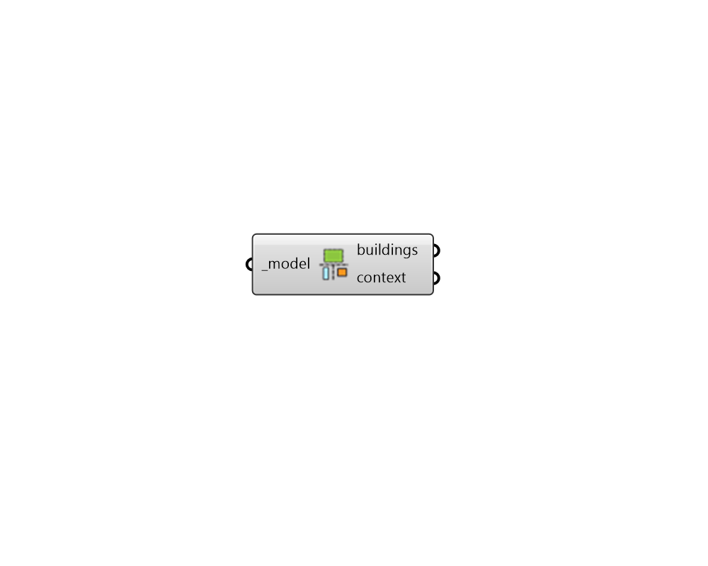

## Deconstruct Model

 - [[source code]](https://github.com/ladybug-tools/dragonfly-grasshopper/blob/master/dragonfly_grasshopper/src//DF%20Deconstruct%20Model.py)

Deconstruct a Dragonfly Model object into all of its constituent Dragonfly objects. 

#### Inputs
* ##### model [Required]
A Dragonfly Model to be deconstructed into into its constituent objects (Buildings, ContextShades). 

#### Outputs
* ##### buildings
All of the Building objects contained within the input Model. 
* ##### context
All of the ContextShade objects within the input Model. 