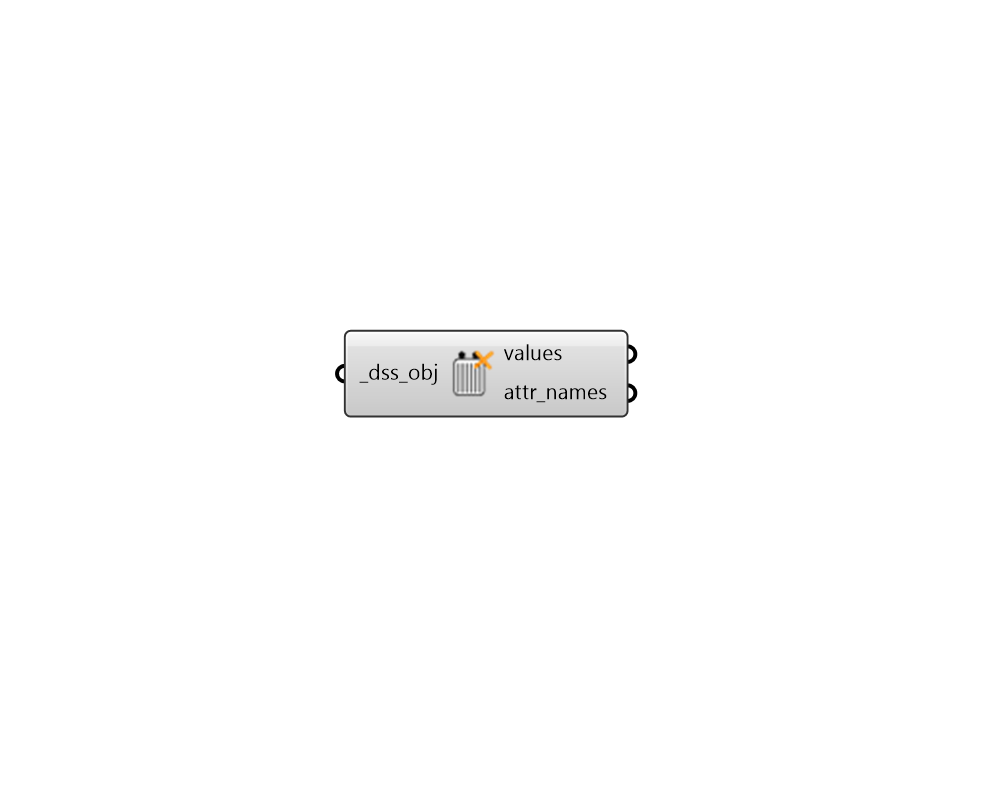

## Deconstruct OpenDSS

 - [[source code]](https://github.com/ladybug-tools/dragonfly-grasshopper/blob/master/dragonfly_grasshopper/src//DF%20Deconstruct%20OpenDSS.py)

Deconstruct an OpenDSS Wire, PowerLine, or Transformer Properties into its constituient attributes and values. 

#### Inputs
* ##### dss_obj [Required]
An OpenDSS Wire, PowerLine, or Transformer Properties to be deconstructed. This can also be text for a Wire, PowerLine, or Transformer to be looked up in the library. 

#### Outputs
* ##### values
List of values for the attributes that define the OpenDSS object. 
* ##### attr_names
List of text that is the same length as the values, which notes the attribute name for each value. 