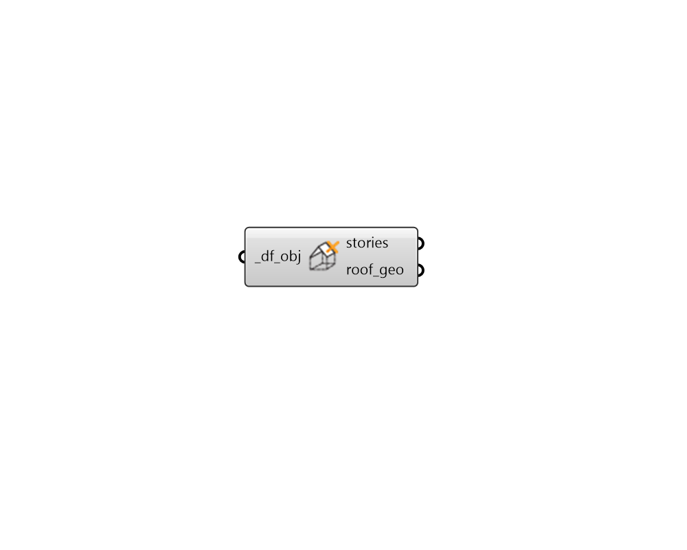

## Deconstruct Roof

 - [[source code]](https://github.com/ladybug-tools/dragonfly-grasshopper/blob/master/dragonfly_grasshopper/src//DF%20Deconstruct%20Roof.py)

Deconstruct any Dragonfly Story, Building or Model to get the Roof geometry. 

This is useful for checking the roof geometry assigned to sotries and possbily editing it so that it can be re-assigned with "DF Apply Roof" component. 

#### Inputs
* ##### df_obj [Required]
A Dragonfly Model, Building, Story for which the roof geometry will be extracted. 

#### Outputs
* ##### stories
The unique Story objects that make up the input _df_obj. This is typically a data tree with branches coordinated with the roof_geo below. 
* ##### roof_geo
A list of Breps representing the geometry of the Roof. This is often a data tree with one branch for each story, which is coordinated with the stories above. 