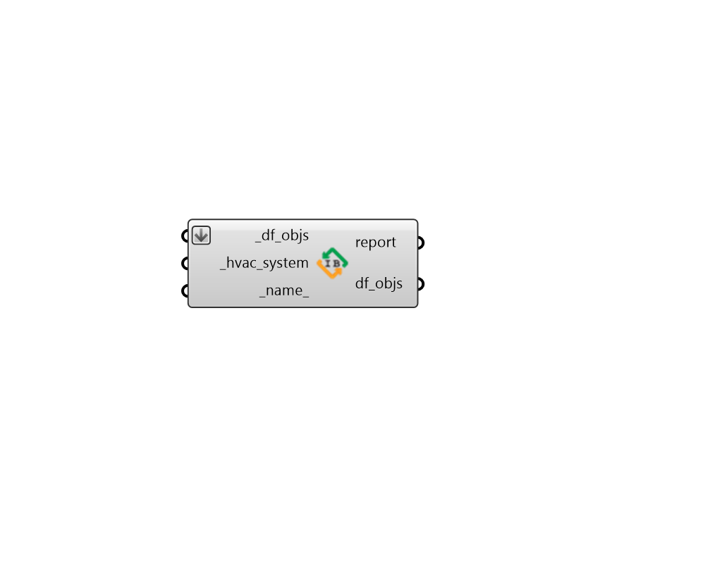

## Detailed HVAC

 - [[source code]](https://github.com/ladybug-tools/dragonfly-grasshopper/blob/master/dragonfly_grasshopper/src//DF%20Detailed%20HVAC.py)

Apply a detailed Ironbug HVAC to Dragonfly Buildings, Stories or Room2Ds. 

#### Inputs
* ##### df_objs [Required]
Dragonfly Buildings, Stories or Room2Ds to which the input Ironbug HVAC will be assigned. This can also be an etire dragonfly Model. Only the relevant Room2Ds referenced in the _hvac_system will be assigned the HVAC system. 
* ##### hvac_system [Required]
A fully-detailed Irongbug HVAC system to be assigned to the input dragonfly objects. 
* ##### name 
Text to set the name for the HVAC system and to be incorporated into unique HVAC identifier. If the name is not provided, a random name will be assigned. 

#### Outputs
* ##### report
Reports, errors, warnings, etc. 
* ##### df_objs
The input Rooms or Model with the detailed HVAC system applied. 