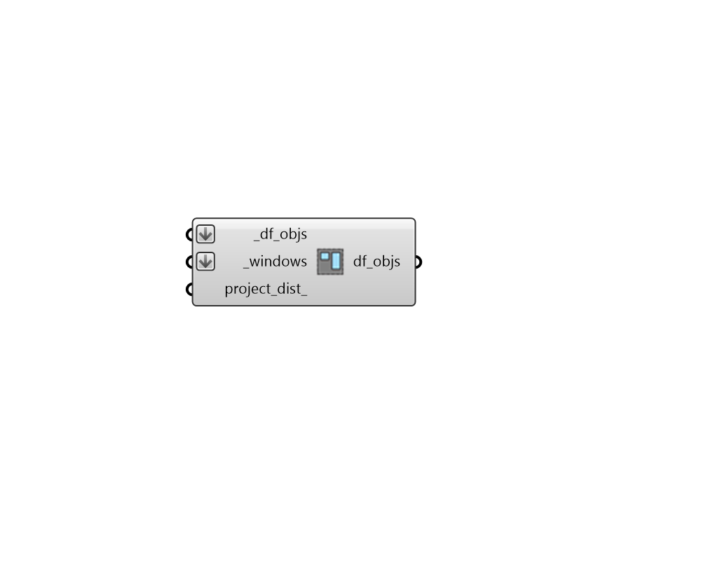

## Detailed Windows

 - [[source code]](https://github.com/ladybug-tools/dragonfly-grasshopper/blob/master/dragonfly_grasshopper/src//DF%20Detailed%20Windows.py)

Add detailed window geometries to Dragonfly Room2Ds. 

#### Inputs
* ##### df_objs [Required]
A Dragonfly Model, Building, Story or Room2D, to which the _windows should be added. 
* ##### windows [Required]
A list of Breps that will be added to the input _df_objs as detailed windows. This can also be a list of orphaned Honeybee Apertures and/or Doors to be added to the Dragonfly objects. In the case of Doors, they will be assigned to the Dragonfly object as such. 
* ##### project_dist 
An optional number to be used to project the Aperture/Door geometry onto parent Faces. If specified, then sub-faces within this distance of the parent Face will be projected and added. Otherwise, Apertures/Doors will only be added if they are coplanar with a parent Face. 

#### Outputs
* ##### df_objs
The input dragonfly objects with the input _windows added to it. 