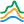

## Diversify Building Programs

 - [[source code]](https://github.com/ladybug-tools/dragonfly-grasshopper/blob/master/dragonfly_grasshopper/src//DF%20Diversify%20Building%20Programs.py)

Diversify the ProgramTypes assigned to a Building's Room2Ds. 

This is useful when attempting to account for the fact that not all rooms are used by occupants according to a strict scheduled regimen. Some rooms will be used more than expected and others less. 

This component uses a random number generator and gaussian distribution to generate loads that vary about the original "mean" programs. Note that the randomly generated values assigned by this component will be different every time that this component is run unless and input for seed_ has been specified. 

In addition to diversifying load values, approximately 2/3 of the schedules in the resulting Room2Ds will be offset from the mean by the input schedule_offset (1/3 ahead and another 1/3 behind). 

#### Inputs
* ##### building [Required]
A Dragonfly Building, which will have its room programs diversified. 
* ##### occ_stdev 
A number between 0 and 100 for the percent of the occupancy people_per_area representing one standard deviation of diversification from the mean. (Default 20 percent). 
* ##### lighting_stdev 
A number between 0 and 100 for the percent of the lighting watts_per_area representing one standard deviation of diversification from the mean. (Default 20 percent). 
* ##### electric_stdev 
A number between 0 and 100 for the percent of the electric equipment watts_per_area representing one standard deviation of diversification from the mean. (Default 20 percent). 
* ##### gas_stdev 
A number between 0 and 100 for the percent of the gas equipment watts_per_area representing one standard deviation of diversification from the mean. (Default 20 percent). 
* ##### hot_wtr_stdev 
A number between 0 and 100 for the percent of the service hot water flow_per_area representing one standard deviation of diversification from the mean. (Default 20 percent). 
* ##### infilt_stdev 
A number between 0 and 100 for the percent of the infiltration flow_per_exterior_area representing one standard deviation of diversification from the mean. (Default 20 percent). 
* ##### sched_offset 
A positive integer for the number of timesteps at which all schedules of the resulting programs will be shifted - roughly 1/3 of the programs ahead and another 1/3 behind. (Default: 1). 
* ##### timestep 
An integer for the number of timesteps per hour at which the shifting is occurring. This must be a value between 1 and 60, which is evenly divisible by 60. 1 indicates that each step is an hour while 60 indicates that each step is a minute. (Default: 1). 
* ##### seed 
An optional integer to set the seed of the random number generator that is diversifying the loads. Setting a value here will ensure that the same "random" values are assigned every time that this component is run, making comparison of energy simulation results easier. If not set, the loads assigned by this component will be different every time it is run. 

#### Outputs
* ##### building
The input Dragonfly Building with its programs diversified. The diversified values can be checked by using the "DF Color Room2D Attributes" component. 