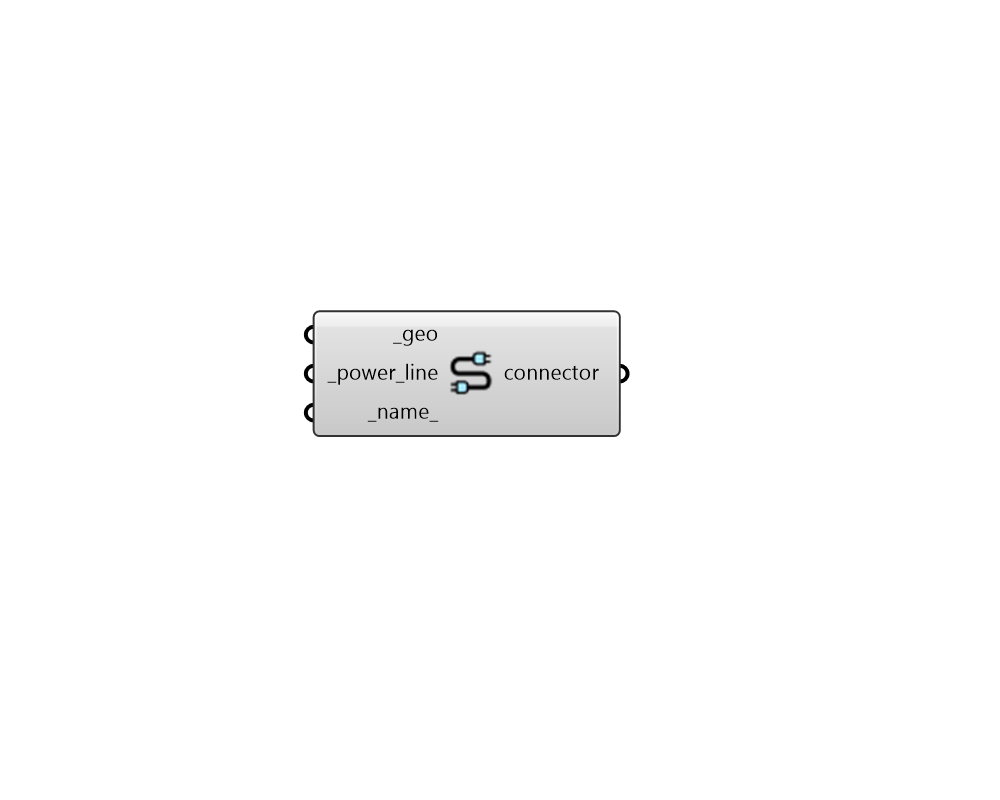

## Electrical Connector

 - [[source code]](https://github.com/ladybug-tools/dragonfly-grasshopper/blob/master/dragonfly_grasshopper/src//DF%20Electrical%20Connector.py)

Create an OpenDSS Electrical Connector from linear geometry and power line properties, which include the wires and their geometrical arrangement. 

#### Inputs
* ##### geo [Required]
A line or polyline representing an Electrical Connector. 
* ##### power_line [Required]
Text for the ID of a PowerLine carried along the electrical connector, which will be looked up in the Power Lines library (the output from the "DF OpenDSS Libraries" component). This can also be a custom PowerLine object created using the Ladybug Tools SDK. 
* ##### name 
Text to set the base name for the Electrical Connector, which will also be incorporated into unique ElectricalConnector identifier. If the name is not provided, a random one will be assigned. 

#### Outputs
* ##### connector
A Dragonfly Electrical Connector object that can be used within an Electrical Network. 