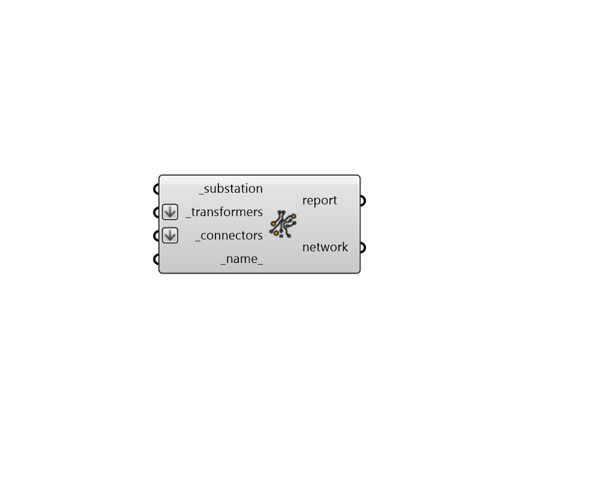

## Electrical Network

 - [[source code]](https://github.com/ladybug-tools/dragonfly-grasshopper/blob/master/dragonfly_grasshopper/src//DF%20Electrical%20Network.py)

Create an OpenDSS Electrical Network, which represents all electrical infrastructure for an OpenDSS simulation. 

This includes a substation, transformers, and all electrical connectors needed to connect these objects to Dragonfly Buildings. 

#### Inputs
* ##### substation [Required]
A Substation object representing the electrical substation supplying the network with electricity. 
* ##### transformers [Required]
An array of Transformer objects that are included within the electrical network. Generally, there should always be a transformer somewhere between the substation and a given building. 
* ##### connectors [Required]
An array of ElectricalConnector objects that are included within the electrical network. In order for a given connector to be valid within the network, each end of the connector must touch either another connector, a transformer/substation or a Dragonfly Building footprint. In order for the network as a whole to be valid, all Buildings and Transformers must be connected back to the Substation via connectors. 
* ##### name 
Text to be used for the name and identifier of the Electrical Newtork. If no name is provided, it will be "unnamed". 

#### Outputs
* ##### report
Reports, errors, warnings, etc. 
* ##### network
A Dragonfly Electrical Newtork object possessing all electrical infrastructure for an OpenDSS simulation. This should be connected to the network_ input of the "DF Model to GeoJSON" component. 