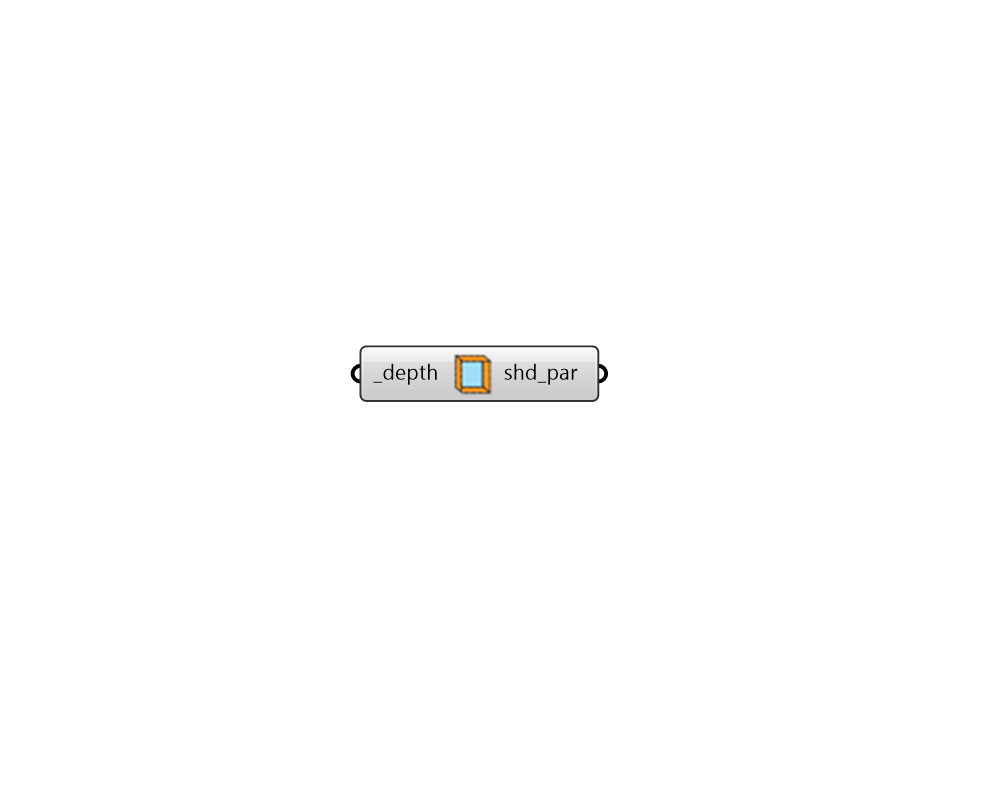

## Extruded Border Parameters

 - [[source code]](https://github.com/ladybug-tools/dragonfly-grasshopper/blob/master/dragonfly_grasshopper/src//DF%20Extruded%20Border%20Parameters.py)

Create Dragonfly shading parameters with instructions for extruded borders over all windows. 

#### Inputs
* ##### depth [Required]
A number for the depth of the extruded border. 

#### Outputs
* ##### shd_par
Shading Parameters that can be applied to a Dragonfly object using the "DF Apply Facade Parameters" component. 