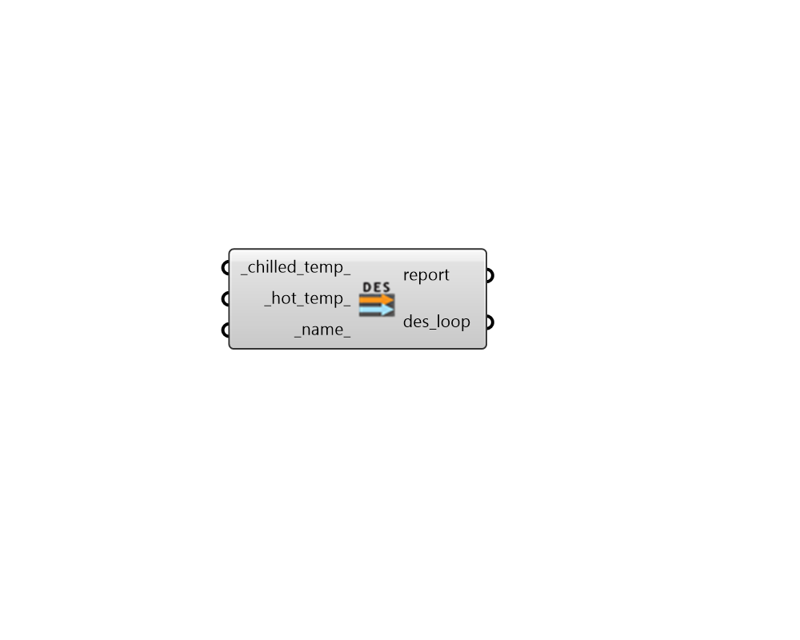

## Fourth Generation Thermal Loop

 - [[source code]](https://github.com/ladybug-tools/dragonfly-grasshopper/blob/master/dragonfly_grasshopper/src//DF%20Fourth%20Generation%20Thermal%20Loop.py)

Create an Fourth Generation Loop for a District Energy Simulation (DES) simulation. 

This includes a central hot and chilled water plant for the district. 

#### Inputs
* ##### chilled_temp 
A number for the temperature of chilled water in the DES in degrees Celsius. (Default: 6). 
* ##### hot_temp 
A number for the temperature of hot water in the DES in degrees Celsius. (Default: 54). 
* ##### name 
Text to be used for the name and identifier of the Thermal Loop. If no name is provided, it will be "unnamed". 

#### Outputs
* ##### report
Reports, errors, warnings, etc. 
* ##### des_loop
A Dragonfly Thermal Loop object possessing all infrastructure for a District Energy Simulation (DES) simulation. This should be connected to the loop_ input of the "DF Model to GeoJSON" component. 