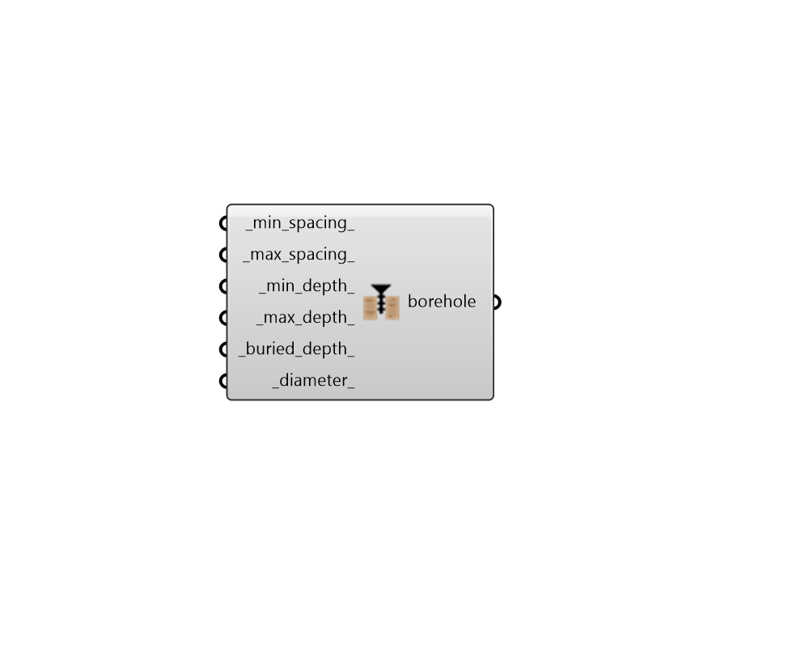

## GHE Borehole Parameter

 - [[source code]](https://github.com/ladybug-tools/dragonfly-grasshopper/blob/master/dragonfly_grasshopper/src//DF%20GHE%20Borehole%20Parameter.py)

Create a BoreholeParameter object that can be used to customize the geometric constraints governing the boreholes of a GHE sizing simulation. 

The output of this component can be used with either the "DF GHE Designer" component or the "DF GHE Thermal Loop" component. 

#### Inputs
* ##### min_spacing 
A number in Rhino model units (eg. Meters, Feet, etc.) for the minimum spacing between boreholes. When the system demand cannot be met using boreholes with the maximum spacing, the borehole spacing will be reduced until either the loads or met or they reach this minimum spacing. So this typically represents the spacing at which each borehole will interfere with neighboring ones so much that it is not worthwhile to decrease the spacing further. (Default: 3 meters). 
* ##### max_spacing 
A number in Rhino model units (eg. Meters, Feet, etc.) for the maximum spacing between boreholes in meters. This will set the starting value for the spacing (Default: 25 meters). 
* ##### min_depth 
A number in Rhino model units (eg. Meters, Feet, etc.) for the minimum depth of the heat-exchanging part of the boreholes in meters. This will set the starting value for the depth (Default: 60 meters). 
* ##### max_depth 
A number in Rhino model units (eg. Meters, Feet, etc.) for the maximum depth of the heat-exchanging part of the boreholes in meters. When the system demand cannot be met using boreholes with the minimum depth, the boreholes will be extended until either the loads or met or they reach the maximum depth specified here. So this typically represents the depth of bedrock or the point at which drilling deeper ceases to be practical. (Default: 135 meters). 
* ##### buried_depth 
A number in Rhino model units (eg. Meters, Feet, etc.) for the depth below the ground surface at which the top of the heat exchanging part of the borehole sits in meters. (Default: 2 meters). 
* ##### diameter 
A number for the diameter of the borehole in meters. (Default: 0.15 meters). 

#### Outputs
* ##### borehole
A BoreholeParameter object that can be plugged into the "DF GHE Designer" component in order to customize the properties of borehole min/max depth and borehole min/max spacing. It can also be plugged into the "DF GHE Thermal Loop" component to perform a similar role in a District Energy Simulation (DES) of a loop with a ground heat exchanger. 