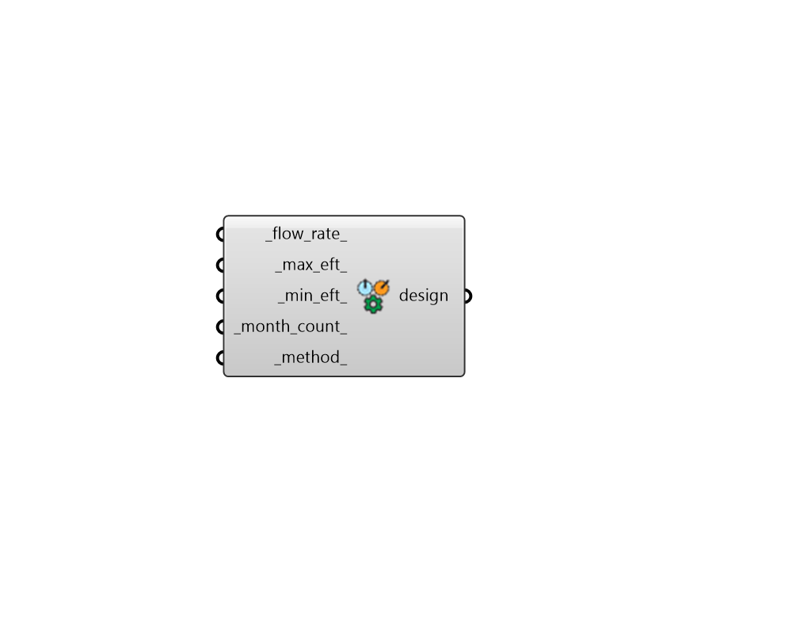

## GHE Design Parameter

 - [[source code]](https://github.com/ladybug-tools/dragonfly-grasshopper/blob/master/dragonfly_grasshopper/src//DF%20GHE%20Design%20Parameter.py)

Create a GHEDesignParameter object that can be used to customize the criteria used to design a Ground Heat Exchanger (GHE). 

The output of this component can be used with either the "DF GHE Designer" component or the "DF GHE Thermal Loop" component. 

#### Inputs
* ##### flow_rate 
A number for the volumetric design flow rate through each borehole of the ground heat exchanger in L/s. (Default: 0.2 L/s). 
* ##### max_eft 
A number for the maximum heat pump entering fluid temperature in Celsius. (Default: 35C). 
* ##### min_eft 
A number for the minimum heat pump entering fluid temperature in Celsius. (Default: 5C). 
* ##### month_count 
An integer for the number of months over which the simulation will be run in order to ensure stable ground temperature conditions. (Default: 240). 
* ##### method 
Text for the method to be used in sizing the GHE. Downstream will size each GHE for all of the buildings that lie downstream of the GHE. AreaProportional will take the load along the entire loop and evenly distribute it per unit area of GHE. (Default: AreaProportional). Choose from the following. 

    * AreaProportional

    * Downstream

#### Outputs
* ##### design
A GHEDesignParameter object that can be plugged into the "DF GHE Designer" component in order to customize the criteria used to design a GHE. It can also be plugged into the "DF GHE Thermal Loop" component to perform a similar role in a District Energy Simulation (DES) of a loop with a ground heat exchanger. 