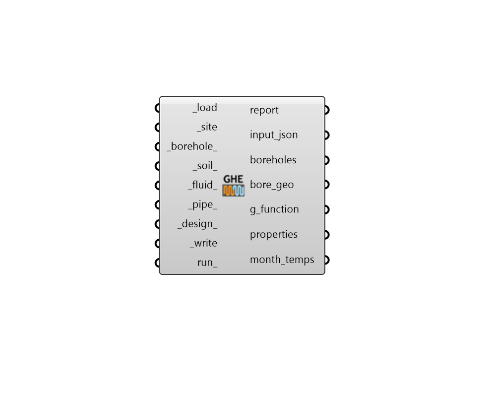

## GHE Designer

 - [[source code]](https://github.com/ladybug-tools/dragonfly-grasshopper/blob/master/dragonfly_grasshopper/src//DF%20GHE%20Designer.py)

Run a GHE Designer simulation to size a ground heat exchanger (GHE) and produce a G-function that can be used in EnergyPlus/IronBug simulations. 

The GHE sizing requires a data collection of hourly ground loads, a planar site geometry indicating where boreholes can be placed, and geometric constraints about the spacing and depth of the boreholes. 

This component uses the GHEDesigner Python package to perform the GHE sizing calculation. GHEDesigner is similar in principle to tools like GLHEPRO but is currently limited to vertical borehole exchangers (it cannot model horizontal exchangers). Also, it requires the input of ground heat extraction/rejection loads. So it currently requires you to account for the COP of heat pumps as a manual pre-step before using building heating/cooling loads as an input. 

More information on GHEDesigner can be found in the documentation here: https://ghedesigner.readthedocs.io/en/latest/background.html 

#### Inputs
* ##### load [Required]
An annual data collection of hourly loads on the ground in Watts. These are the heat extraction and heat rejection loads of the ground heat exchanger and should already account for factors like additional heat added or removed by the heat pump compressors. Positive values indicate heat extraction, negative values indicate heat rejection. 
* ##### site [Required]
A list of horizontal Rhino surfaces representing a footprint of the site to be populated with boreholes. These surfaces can have holes in them and these holes will be excluded from borehole placement. 
* ##### borehole 
A GHE BoreholeParameter object from the "DF GHE Borehole Parameters" component, which customizes properties like borehole min/max depth and borehole min/max spacing. 
* ##### soil 
A GHE SoilParameter object from the "DF GHE Soil Parameters" component. This can be used to customize the conductivity and density of the soil as well as the grout that fills the borehole. 
* ##### fluid 
A GHE Fluid object from the "DF GHE Fluid Parameters" component. This can be used to customize the fuild used (eg. water, glycol) as well as the concentration of the fluid. (Default: 100% Water). 
* ##### pipe 
A GHEPipe object from the "DF GHE Pipe Parameters" component. This can be used to customize the pipe diameter, conductivty, and roughness. 
* ##### design 
A GHEDesign object from the "DF GHE Design" component. This can be used to customize the mina and max entering fluid temperatures as well as the max boreholes. 
* ##### write [Required]
Set to "True" to run the component, install any missing dependencies, and write the input JSON for GHEDesigner. 
* ##### run 
Set to "True" to run GHEDesigner once the JSON is written. This will ensure that all result files appear in their respective outputs from this component. 

#### Outputs
* ##### report
Reports, errors, warnings, etc. 
* ##### input_json
Path to the JSON file that was used to specify inputs for the GHEDesigner. 
* ##### boreholes
A list of points for the borehole locations within the _site. 
* ##### bore_geo
Script variable GHEDesigner 
* ##### g_function
A data tree of G-function coefficients that describe the response of the ground to the input loads. Each pair of factors represents a point on the G-function. Flattening this data tree enables you to plug it directly into the "Ironbug Ground Heat Exchanger Vertical" component to simulate the ground heat exchanger in EnergyPlus. 
* ##### properties
A list of properties for the GHE that can be used to describe it in EnergyPlus simulations. The properties that can be plugged directly into the parameters of the "Ironbug Ground Heat Exchanger Vertical" component. The properties are in the following order: 

    * Borehole Length

    * Borehole Radius

    * Design Flow Rate

    * Ground Temperature

    * Ground Conductivity

    * Ground Heat Capacity

    * Grout Conductivity

    * Number of Boreholes

    * Pipe Outer Diameter

    * Pipe Conductivity

    * Pipe Thickness

    * U Tube Distance
* ##### month_temps
A list of ground temperatures in Celsius with one value for each month of the period over which the GHEDesigner simulation was run (typically 20 years). This can be connected to a nativ Grasshopper "Quick Graph" component and used to check the drift in the ground temperature over long periods of time. 