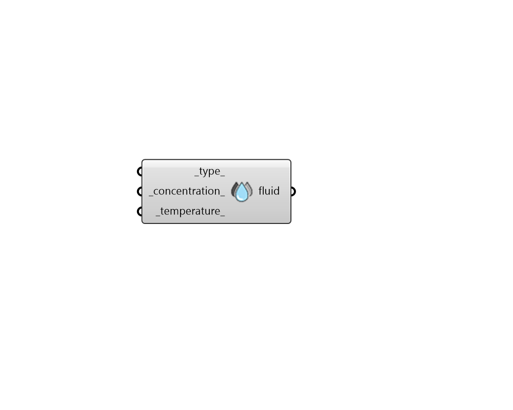

## GHE Fluid Parameter

 - [[source code]](https://github.com/ladybug-tools/dragonfly-grasshopper/blob/master/dragonfly_grasshopper/src//DF%20GHE%20Fluid%20Parameter.py)

Create a FluidParameter object that can be used to customize the fluid properties within a Ground Heat Exchanger (GHE) sizing simulation. 

The output of this component can be used with either the "DF GHE Designer" component or the "DF GHE Thermal Loop" component. 

#### Inputs
* ##### type 
Text to indicate the type of fluid circulating through a ground heat exchanger loop. Many ground heat exchangers use only water but other options may be used to prevent freezing in conditions where the ground is particularly cold. Choose from the options below. (Default: Water). 

    * Water

    * EthylAlcohol

    * EthyleneGlycol

    * MethylAlcohol

    * PropyleneGlycol
* ##### concentration 
A number between 0 and 60 for the concentration of the fluid_type in water in percent. Note that this variable has no effect when the fluid_type is Water. (Default: 35%). 
* ##### temperature 
A number for the average design fluid temperature at peak conditions in Celsius. (Default: 20C). 

#### Outputs
* ##### fluid
A FluidParameter object that can be plugged into the "DF GHE Designer" component in order to customize fluid properties of a GHE sizing simulation. It can also be plugged into the "DF GHE Thermal Loop" component to perform a similar role in a District Energy Simulation (DES) of a loop with a ground heat exchanger. 