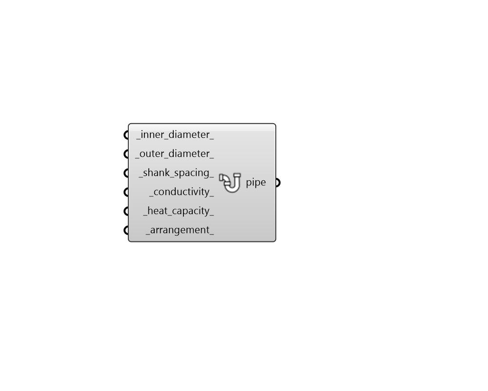

## GHE Pipe Parameter

 - [[source code]](https://github.com/ladybug-tools/dragonfly-grasshopper/blob/master/dragonfly_grasshopper/src//DF%20GHE%20Pipe%20Parameter.py)

Create a PipeParameter object that can be used to customize the pipe properties within a Ground Heat Exchanger (GHE) sizing simulation. 

The output of this component can be used with either the "DF GHE Designer" component or the "DF GHE Thermal Loop" component. 

#### Inputs
* ##### inner_diameter 
A number in Rhino model units (eg. Meters, Feet, etc.) for the diameter of the inner pipe surface in meters. (Default: 0.0216 meters). 
* ##### outer_diameter 
A number in Rhino model units (eg. Meters, Feet, etc.) for the diameter of the outer pipe surface in meters. (Default: 0.0266 meters). 
* ##### shank_spacing 
A number in Rhino model units (eg. Meters, Feet, etc.) for the spacing between the U-tube legs, as referenced from outer surface of the pipes in meters. (NOT referenced from each pipe's respective centerline). (Default: 0.0323 meters). 
* ##### conductivity 
A number for the conductivity of the pipe material in W/m-K. (Default: 0.4). 
* ##### heat_capacity 
A number for the volumetric heat capacity of the pipe material in J/m3-K. (Default: 1,542,000). 
* ##### arrangement 
Text for the specified pipe arrangement. Choose from the following options. (Default: SingleUTube). 

    * SingleUTube

    * DoubleUTubeSeries

    * DoubleUTubeParallel

#### Outputs
* ##### pipe
A PipeParameter object that can be plugged into the "DF GHE Designer" component in order to customize pipe properties of a GHE sizing simulation. It can also be plugged into the "DF GHE Thermal Loop" component to perform a similar role in a District Energy Simulation (DES) of a loop with a ground heat exchanger. 