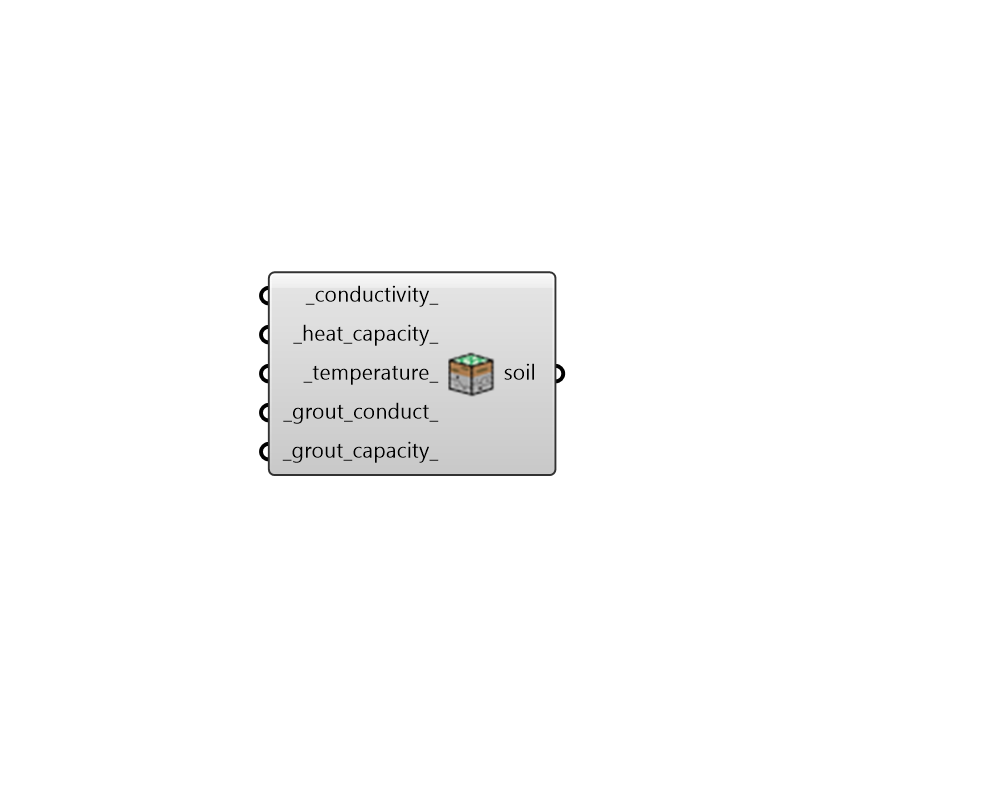

## GHE Soil Parameter

 - [[source code]](https://github.com/ladybug-tools/dragonfly-grasshopper/blob/master/dragonfly_grasshopper/src//DF%20GHE%20Soil%20Parameter.py)

Create a SoilParameter object that can be used to customize the soil and grout properties within a Ground Heat Exchanger (GHE) sizing simulation. 

The output of this component can be used with either the "DF GHE Designer" component or the "DF GHE Thermal Loop" component. 

#### Inputs
* ##### conductivity 
A number for the soil conductivity in W/m-K. (Default: 2.3). 
* ##### heat_capacity 
A number for the volumetric heat capacity of the soil in J/m3-K. (Default: 2,343,500). 
* ##### temperature 
A number for the undisturbed annual average soil temperature in degrees Celsius. If unspecified, this value will automatically be replaced with the average EPW temperature before simulation of a District Energy System (DES). Alternatively, if this component is used with the "DF GHE Designer" component, it will be 18.3C. 
* ##### grout_conduct 
A number for the grout conductivity in W/m-K. (Default: 1.0). 
* ##### grout_capacity 
A number for the volumetric heat capacity of the soil in J/m3-K. (Default: 3,901,000). 

#### Outputs
* ##### soil
A SoilParameter object that can be plugged into the "DF GHE Designer" component in order to customize soil properties of a GHE sizing simulation. It can also be plugged into the "DF GHE Thermal Loop" component to perform a similar role in a District Energy Simulation (DES) of a loop with a ground heat exchanger. 