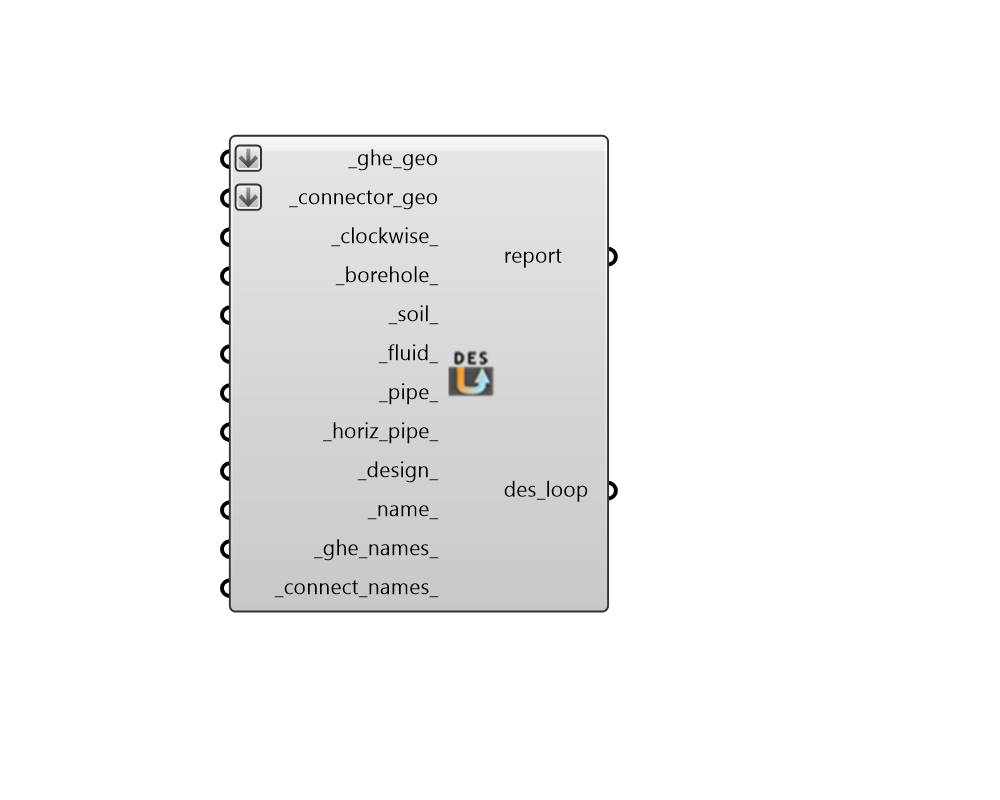

## GHE Thermal Loop

 - [[source code]](https://github.com/ladybug-tools/dragonfly-grasshopper/blob/master/dragonfly_grasshopper/src//DF%20GHE%20Thermal%20Loop.py)

Create an Ground Heat Exchanger Thermal Loop, which represents all infrastructure for a District Energy Simulation (DES) simulation. 

This includes a ground heat exchanger and all thermal connectors needed to connect these objects to Dragonfly Buildings. 

#### Inputs
* ##### ghe_geo [Required]
Horizontal Rhino surfaces representing the footprints of ground heat exchangers. These ground heat exchanging fields contain the boreholes that supply the loop with thermal capacity. Multiple borehole fields can be located along the loop created by the _connector_geo. 
* ##### connector_geo [Required]
An array of lines or polylines representing the thermal connectors within the thermal loop. In order for a given connector to be valid within the loop, each end of the connector must touch either another connector, a building footprint, or a ground heat exchanger. In order for the loop as a whole to be valid, the connectors must form a single continuous loop when passed through the buildings and the heat exchanger field. 
* ##### clockwise 
A boolean to note whether the direction of flow through the loop is clockwise (True) when viewed from above in the GeoJSON or it is counterclockwise (False). (Default: False). 
* ##### bore_depth 
A number for the maximum depth of the heat-exchanging part of the boreholes in meters. This can also be a domain (aka interval) that sets the minimum and maximum depths of the boreholes (when the default minimum depth of 60 meters is not desirable). When the system demand cannot be met using boreholes with the minimum depth, the boreholes will be extended until either the loads or met or they reach the maximum depth specified here. So this typically represents the depth of bedrock or the point at which drilling deeper ceases to be practical. (Default: 135 meters). 
* ##### bore_spacing 
A number for the minimum spacing between boreholes in meters. This can also be a domain (aka interval) that sets the minimum and maximum spacing of the boreholes (when the default maximum spacing of 10 meters is not desirable). When the system demand cannot be met using boreholes with the maximum spacing, the borehole spacing will be reduced until either the loads or met or they reach this minimum spacing. So this typically represents the spacing at which each borehole will interfere with neighboring ones so much that it is not worthwhile to decrease the spacing further. (Default: 3 meters). 
* ##### soil_conduct 
A number for the soil conductivity in W/m-K. (Default: 2.3). 
* ##### soil_heat_cap 
A number for the volumetric heat capacity of the soil in J/m3-K. (Default: 2,343,500). 
* ##### fluid_type 
Text to indicate the type of fluid circulating through the ground heat exchanger loop. Choose from the options below. (Default: Water). 

    * Water

    * EthylAlcohol

    * EthyleneGlycol

    * MethylAlcohol

    * PropyleneGlycol
* ##### concentration 
A number between 0 and 60 for the concentration of the fluid_type in water in percent. Note that this variable has no effect when the fluid_type is Water. (Default: 35). 
* ##### name 
Text to be used for the name and identifier of the Thermal Loop. If no name is provided, it will be "unnamed". 

#### Outputs
* ##### report
Reports, errors, warnings, etc. 
* ##### des_loop
A Dragonfly Thermal Loop object possessing all infrastructure for a District Energy Simulation (DES) simulation. This should be connected to the loop_ input of the "DF Model to GeoJSON" component. 