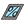

## Gridded Skylight Parameters

 - [[source code]](https://github.com/ladybug-tools/dragonfly-grasshopper/blob/master/dragonfly_grasshopper/src//DF%20Gridded%20Skylight%20Parameters.py)

Create Dragonfly skylight parameters with instructions for generating skylights according to a ratio with the base Roof surface. 

#### Inputs
* ##### ratio [Required]
A number between 0 and 0.75 for the ratio between the skylight area and the total Roof face area. 
* ##### spacing 
A number for the spacing between the centers of each grid cell. This should be less than half of the dimension of the Roof geometry if multiple, evenly-spaced skylights are desired. If None, a spacing of one half the smaller dimension of the parent Roof will be automatically assumed. (Default: None). 

#### Outputs
* ##### skylight
Skylight Parameters that can be applied to a Dragonfly object using the "DF Apply Facade Parameters" component. 