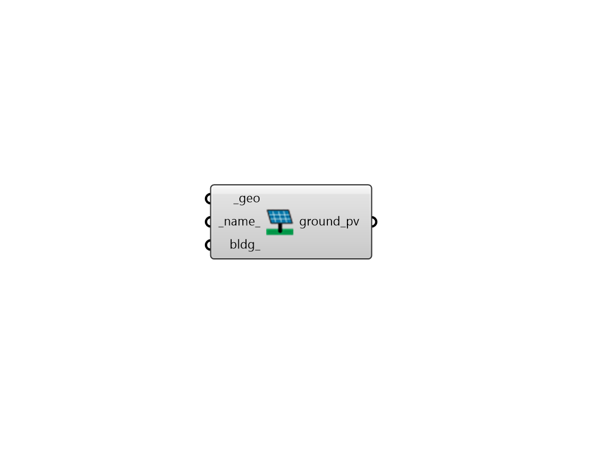

## Ground Photovoltaics

 - [[source code]](https://github.com/ladybug-tools/dragonfly-grasshopper/blob/master/dragonfly_grasshopper/src//DF%20Ground%20Photovoltaics.py)

Create a REopt ground-mounted photovoltaic system from its footprint geometry (horizontal Rhino surfaces). 

#### Inputs
* ##### geo [Required]
A horizontal Rhino surface (or closed polyline) representing a footprint to be converted into a ground-mounted photovoltaic system. 
* ##### name 
Text to set the name for the PV system, which will also be incorporated into unique PV system identifier.  If the name is not provided, a random one will be assigned. 
* ##### bldg 
An optional Dragonfly Building with which the photovoltaic system is associated. If None, the PV system will be assumed to be a community PV field that isn't associated with a particular building meter. 

#### Outputs
* ##### ground_pv
A Dragonfly ground-mounted PV system object that can be exported to a GeoJSON in order to account for ground-mounted photovoltaics in a REopt simulation. 