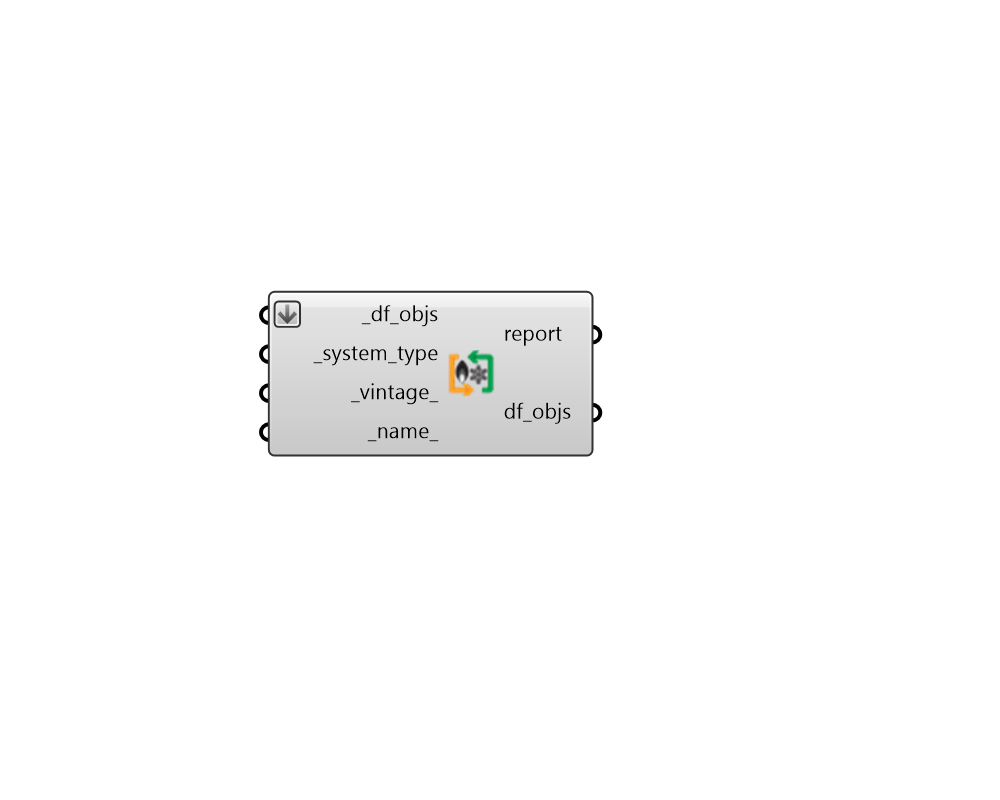

## HeatCool HVAC

 - [[source code]](https://github.com/ladybug-tools/dragonfly-grasshopper/blob/master/dragonfly_grasshopper/src//DF%20HeatCool%20HVAC.py)

Apply a template system that only supplies heating and/or cooling (no ventilation) to a list of Dragonfly Buildings, Stories or Room2Ds. 

These systems are only designed to satisfy heating + cooling demand and they cannot meet any minimum ventilation requirements. 

As such, these systems tend to be used in residential or storage settings where meeting minimum ventilation requirements may not be required or the density of occupancy is so low that infiltration is enough to meet fresh air demand. 

#### Inputs
* ##### df_objs [Required]
Dragonfly Buildings, Stories or Room2Ds to which the input template HVAC will be assigned. If a list of Room2Ds is input, all objects will receive the same HVAC instance. Otherwise, each object gets its own instance (eg. each input Story will get its own HVAC). This can also be an etire dragonfly Model. 
* ##### system_type [Required]
Text for the specific type of heating/cooling system and equipment. The "HB HeatCool HVAC Templates" component has a full list of the supported Heating/Cooling system templates. 
* ##### vintage 
Text for the vintage of the template system. This will be used to set efficiencies for various pieces of equipment within the system. The "HB Building Vintages" component has a full list of supported HVAC vintages. (Default: ASHRAE_2019). 
* ##### name 
Text to set the name for the heating/cooling system and to be incorporated into unique system identifier. If the name is not provided, a random name will be assigned. 

#### Outputs
* ##### report
Script variable OSHVACSystems 
* ##### df_objs
The input Dragonfly objects with a heating/cooling system applied. 