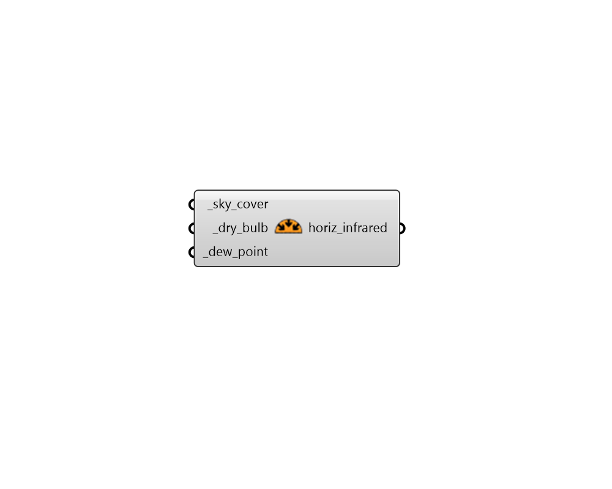

## Horizontal Infrared

 - [[source code]](https://github.com/ladybug-tools/dragonfly-grasshopper/blob/master/dragonfly_grasshopper/src//DF%20Horizontal%20Infrared.py)

Calculate downwelling horizontal infrared radiation intensity from sky cover, dry bulb temperature, and dew point temperature. 

#### Inputs
* ##### sky_cover [Required]
A value or data collection representing sky cover [tenths] 
* ##### dry_bulb [Required]
A value or data collection representing  dry bulb temperature [C] 
* ##### dew_point [Required]
A value or data collection representing dew point temperature [C] 

#### Outputs
* ##### horiz_infrared
A data collection or value indicating the downwelling horizontal infrared radiation [W/m2] 