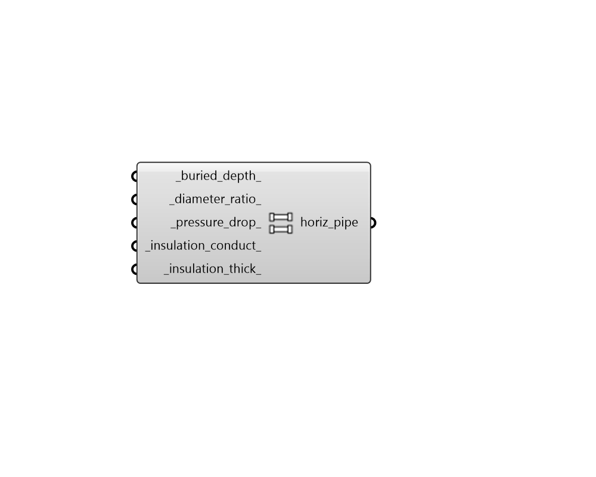

## Horizontal Pipe Parameter

 - [[source code]](https://github.com/ladybug-tools/dragonfly-grasshopper/blob/master/dragonfly_grasshopper/src//DF%20Horizontal%20Pipe%20Parameter.py)

Create a HorizontalPipeParameter object that can be used to customize the properties of horizontal pipes contained within ThermalConnectors. 

The output of this component can be used with the "DF GHE Thermal Loop" component. 

#### Inputs
* ##### buried_depth 
The buried depth of the pipes in Rhino model units (eg. Meters, Feet, etc.). (Default: 1.5 meters). 
* ##### diameter_ratio 
A number for the ratio of pipe outer diameter to pipe wall thickness. (Default: 11). 
* ##### pressure_drop 
A number for the pressure drop in pascals per meter of pipe. (Default: 300). 
* ##### insulation_conduct 
A positive number for the conductivity of the pipe insulation material in W/m-K. If no insulation exists, this value should be a virtual insulation layer of soil since this value must be greater than zero. (Default: 3.0). 
* ##### insulation_thick 
A positive number for the thickness of pipe insulation in Rhino model units (eg. Meters, Feet, etc.). If no insulation exists, this value should be a virtual insulation layer of soil since this value must be greater than zero. (Default: 0.2 meters). 

#### Outputs
* ##### horiz_pipe
A HorizontalPipeParameter object that can be plugged into the "DF GHE  Thermal Loop" component to customize the properties of horizonal pipes in a District Energy System (DES) simulation. 