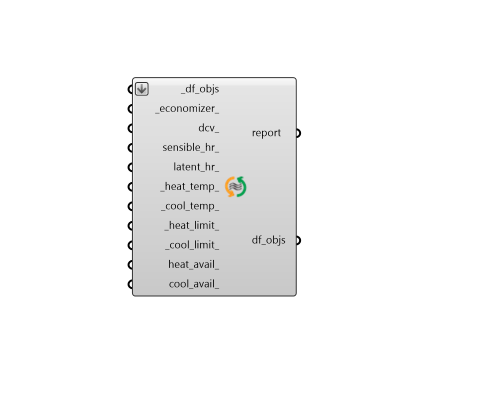

## IdealAir

 - [[source code]](https://github.com/ladybug-tools/dragonfly-grasshopper/blob/master/dragonfly_grasshopper/src//DF%20IdealAir.py)

Apply a customized IdealAirSystem to Dragonfly Buildings, Stories or Room2Ds. 

#### Inputs
* ##### df_objs [Required]
Dragonfly Buildings, Stories or Room2Ds to which the input ideal air properties will be assigned. This can also be an etire dragonfly Model. 
* ##### economizer 
Text to indicate the type of air-side economizer used on the ideal air system. Economizers will mix in a greater amount of outdoor air to cool the zone (rather than running the cooling system) when the zone needs cooling and the outdoor air is cooler than the zone. Choose from the options below. Default: DifferentialDryBulb. 

    * NoEconomizer

    * DifferentialDryBulb

    * DifferentialEnthalpy
* ##### dcv 
Boolean to note whether demand controlled ventilation should be used on the system, which will vary the amount of ventilation air according to the occupancy schedule of the zone. Default: False. 
* ##### sensible_hr 
A number between 0 and 1 for the effectiveness of sensible heat recovery within the system. Default: 0. 
* ##### latent_hr 
A number between 0 and 1 for the effectiveness of latent heat recovery within the system. Default: 0. 
* ##### heat_temp 
A number for the maximum heating supply air temperature [C]. Default: 50, which is typical for many air-based HVAC systems. 
* ##### cool_temp 
A number for the minimum cooling supply air temperature [C]. Default: 13, which is typical for many air-based HVAC systems. 
* ##### heat_limit 
A number for the maximum heating capacity in Watts. This can also be the text 'autosize' to indicate that the capacity should be determined during the EnergyPlus sizing calculation. This can also be the text 'NoLimit' to indicate no upper limit to the heating capacity. Default: 'autosize'. 
* ##### cool_limit 
A number for the maximum cooling capacity in Watts. This can also be the text 'autosize' to indicate that the capacity should be determined during the EnergyPlus sizing calculation. This can also be the text 'NoLimit' to indicate no upper limit to the cooling capacity. Default: 'autosize'. 
* ##### heat_avail 
An optional on/off schedule to set the availability of heating over the course of the simulation. This can also be the identifier of an on/off schedule to be looked up in the schedule library (Default: None). 
* ##### cool_avail 
An optional on/off schedule to set the availability of cooling over the course of the simulation. This can also be the identifier of an on/off schedule to be looked up in the schedule library (Default: None). 

#### Outputs
* ##### report
The execution information, as output and error streams 
* ##### df_objs
The input Dragonfly object with the custom Ideal Air System assigned. 