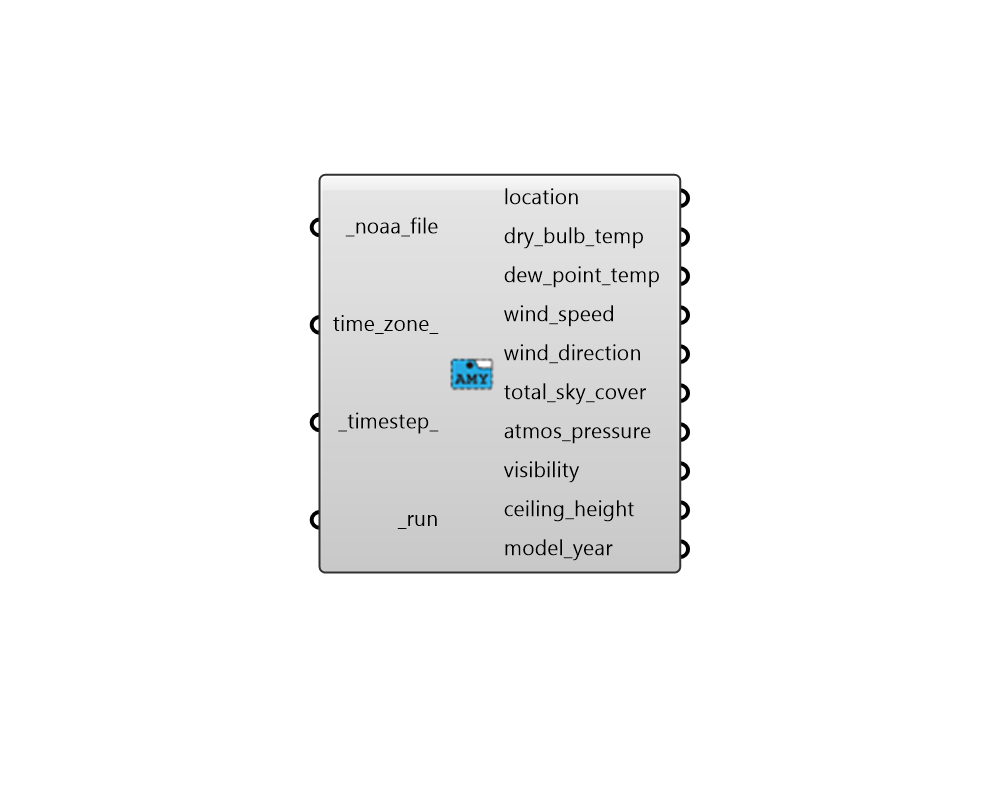

## Import NOAA File

 - [[source code]](https://github.com/ladybug-tools/dragonfly-grasshopper/blob/master/dragonfly_grasshopper/src//DF%20Import%20NOAA%20File.py)

Import climate data from a .csv file of annual data obtained from the National Oceanic and Atmospheric Administration (NOAA) database.  The database can be accessed here: https://gis.ncdc.noaa.gov/maps/ncei/cdo/hourly 

#### Inputs
* ##### noaa_file [Required]
The path to a .csv file of annual data obtained from the NOAA database on your system as a string. 
* ##### time_zone 
Optional time zone for the station.  If blank, a default time zone will be estimated from the longitude. 
* ##### timestep 
Integer forthe timestep at which the data collections should be output. Data in the .csv that does not conform to this timestep will be ignored in the output data collections. This can be set as high as 60 to ensure that all data from the .csv file is imported. However, such large data collections can be time consuming to edit. (Default: 1). 
* ##### run [Required]
Set to True to run the component and import the data. 

#### Outputs
* ##### location
Script variable ImportNOAA 
* ##### dry_bulb_temp
The houlry dry bulb temperature, in C. Note that this is a full numeric field (i.e. 23.6) and not an integer representation with tenths. Valid values range from 70 C to 70 C. Missing value for this field is 99.9. 
* ##### dew_point_temp
The hourly dew point temperature, in C. Note that this is a full numeric field (i.e. 23.6) and not an integer representation with tenths. Valid values range from 70 C to 70 C. Missing value for this field is 99.9. 
* ##### wind_speed
The hourly wind speed in m/sec. Values can range from 0 to 40. Missing value is 999. 
* ##### wind_direction
The hourly wind direction in degrees. The convention is that North=0.0, East=90.0, South=180.0, West=270.0. (If wind is calm for the given hour, the direction equals zero.) Values can range from 0 to 360. Missing value is 999. 
* ##### total_sky_cover
The fraction for total sky cover (tenths of coverage). (i.e. 1 is 1/10 covered. 10 is total coverage) (Amount of sky dome in tenths covered by clouds or obscuring phenomena at the hour indicated at the time indicated.) Minimum value is 0; maximum value is 10; missing value is 99." 
* ##### atmos_pressure
The hourly weather station pressure in Pa. Valid values range from 31,000 to 120,000... Missing value for this field is 999999." 
* ##### visibility
This is the value for visibility in km. (Horizontal visibilitY). It is not currently used in EnergyPlus calculations. Missing value is 9999. 
* ##### ceiling_height
Script output ceiling_height. 
* ##### model_year
The year from which the hourly data has been extracted. Note that, for this component to run correclty, all of the data in the text file must be from a single year. 