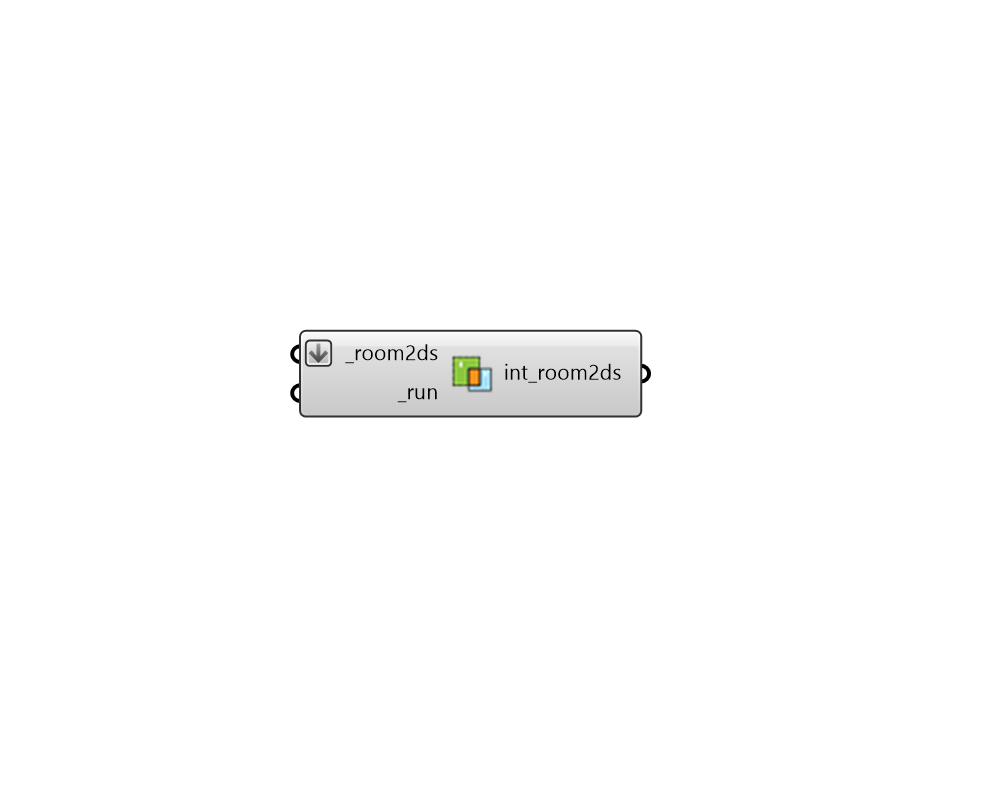

## Intersect Room2Ds

 - [[source code]](https://github.com/ladybug-tools/dragonfly-grasshopper/blob/master/dragonfly_grasshopper/src//DF%20Intersect%20Room2Ds.py)

Take a list of Dragonfly Room2Ds and split their adjacent Walls to ensure that there are matching segments between each of the adjacent Room2Ds. 

Note that this component effectively erases all assigned boundary conditions, glazing parameters and shading parameters as the original segments are subdivided. As such, it is recommended that this component be used before all other steps when creating a Story. 

Also note that this component does not actually set the walls that are next to one another to be adjacent. The "DF Solve Adjacency" component must be used for this after runing this component. 

#### Inputs
* ##### room2ds [Required]
A list of Room2Ds for which adjacencent segments will be intersected. 
* ##### run [Required]
Set to True to run the component. 

#### Outputs
* ##### int_room2ds
An array of Room2Ds that have been intersected with one another. Note that these Room2Ds lack all assigned boundary conditions, glazing parameters and shading parameters of the original Room2Ds. 