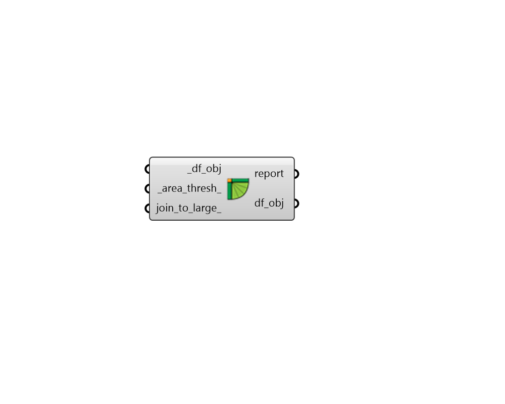

## Join Small Rooms

 - [[source code]](https://github.com/ladybug-tools/dragonfly-grasshopper/blob/master/dragonfly_grasshopper/src//DF%20Join%20Small%20Rooms.py)

Join small Room2Ds together within Dragonfly Stories. 

This is particularly useful after operations like automatic core/perimeter offsetting, which can create several small Room2Ds from small segments in the outline boundary around the Story. 

#### Inputs
* ##### df_obj [Required]
A Dregonfly Story, Building or Model to have its small Room2Ds joined together across the model 
* ##### area_thresh 
A number for the Room2D floor area below which it is considered a small room to be joined into adjacent rooms. (Default: 10.0 square meters). 
* ##### join_to_large 
A boolean to note whether the small Room2Ds should be joined into neighboring large Room2Ds as opposed to simply joining the small rooms to one another. (Default: False). 

#### Outputs
* ##### report
Reports, errors, warnings, etc. 
* ##### df_obj
The input Dragonfly objects with Room2Ds that have had small Room2Ds joined together. 